[link](https://threejs.org/examples)

# webgl_animation_cloth

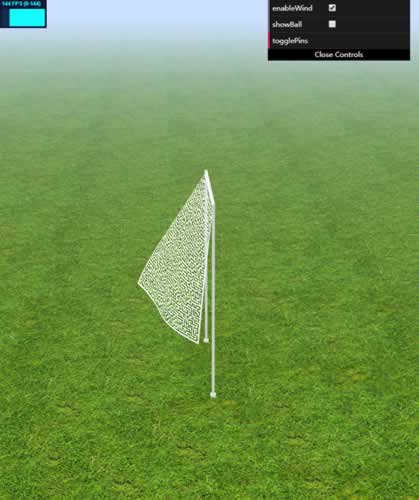

- main.js : 包含场景, 模拟风/球等全局代码.
- cloth.js : 模拟布料

# webgl_animation_keyframes

需要网盘资源

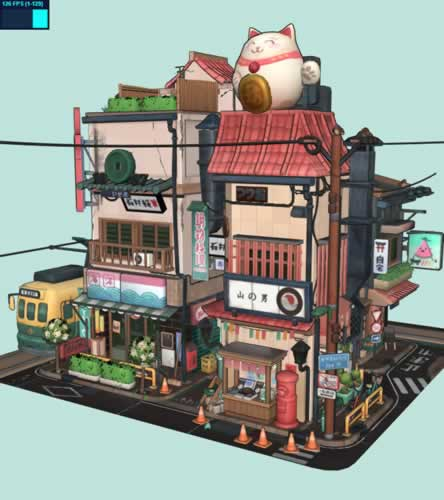

gltf 包含模型文件, 文件较大故单独放到网盘上了.

# webgl-animation-skinning-blending

需要网盘资源

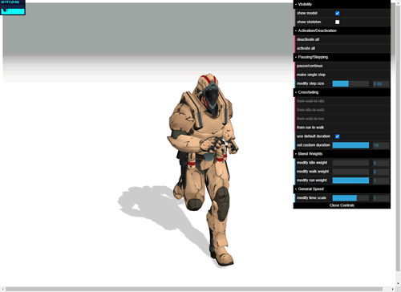

# webpack 运行的项目:

```bash
# 首次运行先生成 dll
npx webpack --config webpack.dll.config.js
# 开启 webpack 测试服务器
npx webpack-dev-server
```


# webgl_animation_skinning_morph

需要网盘资源


# webgl_animation_skinning_additive_blending

需要网盘资源

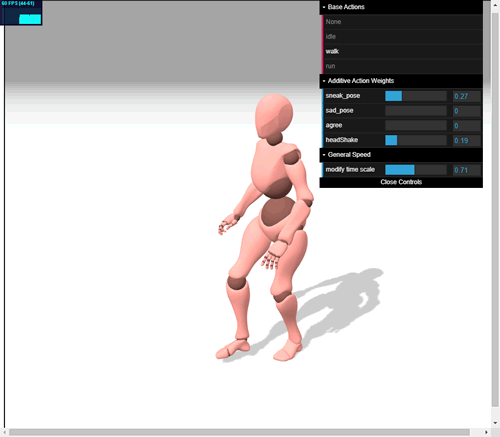

# webgl_animation_multiple

需要网盘资源

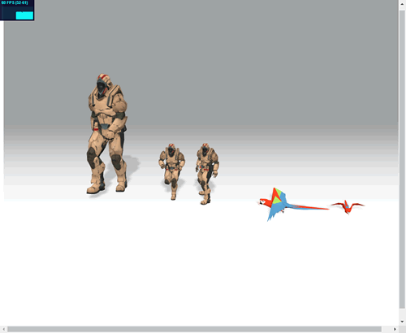

# webgl_camera

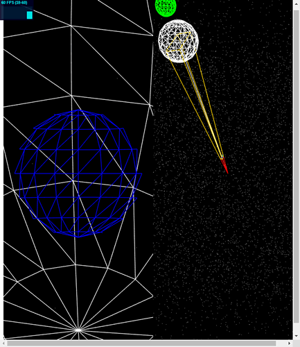

# webgl_camera_array

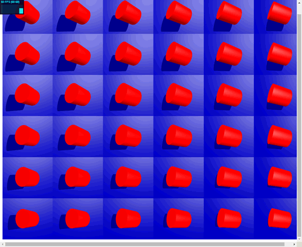

# webgl_camera_cinematic

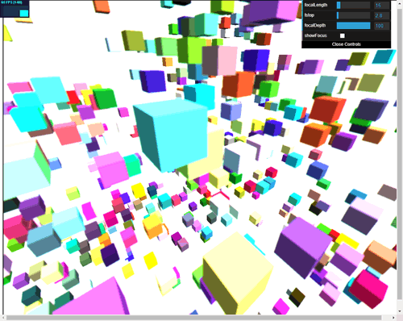

# webgl_camera_logarithmicdepthbuffer

需要网盘资源


# webgl_clipping

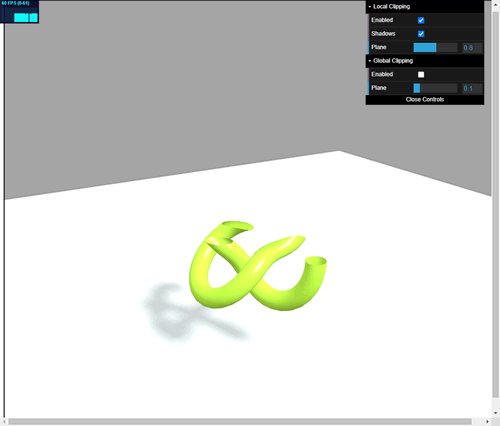

# webgl_clipping_advanced

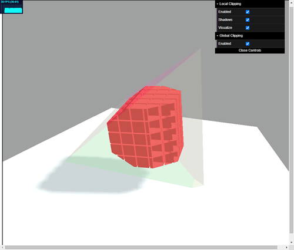

# webgl_clipping_intersection

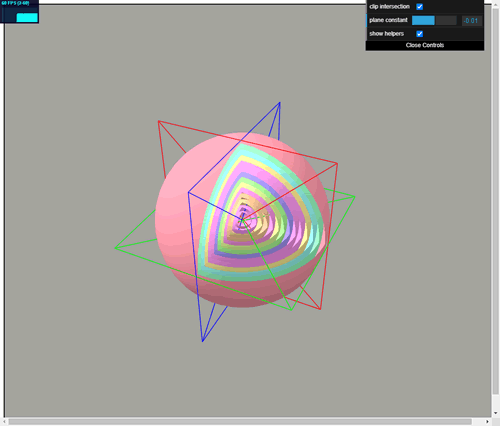

# webgl_clipping_stencil

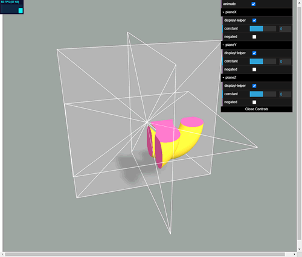

# webgl_decals

需要网盘资源

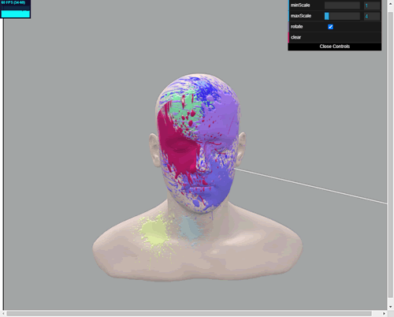

# webgl_depth_texture


# webgl_effects_anaglyph

需要网盘资源

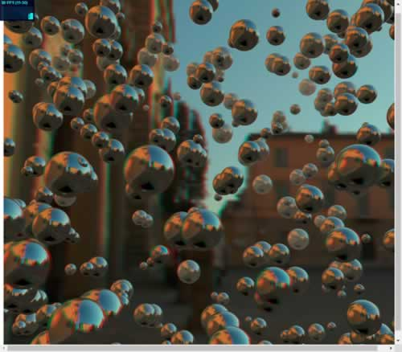

# webgl_effects_ascii

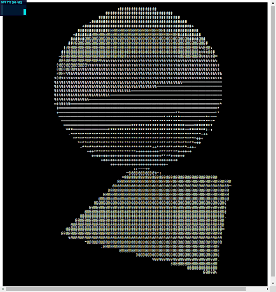

# webgl_effects_parallaxbarrier

需要网盘资源

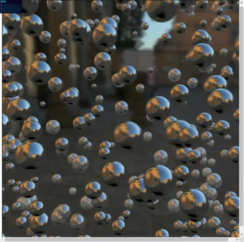

# webgl_effects_peppersghost

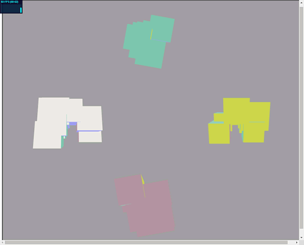

# webgl_effects_stereo

需要网盘资源

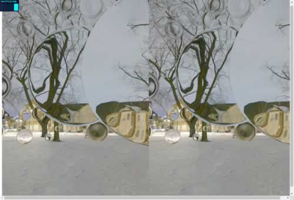

# webgl_geometries

需要网盘资源

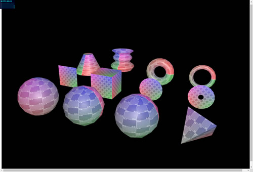

# webgl_geometries_parametric

需要网盘资源

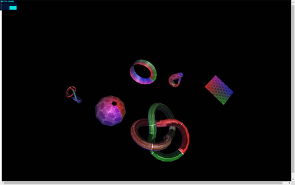

# webgl_geometry_colors

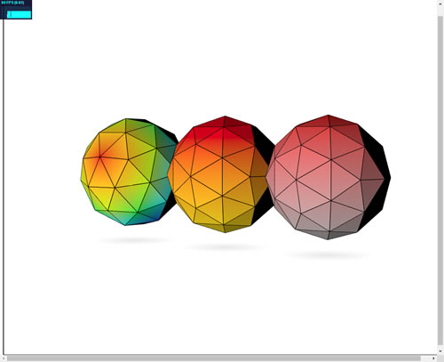

# webgl_geometry_colors_lookuptable

webgl/geometry/webgl_geometry_colors_lookuptable

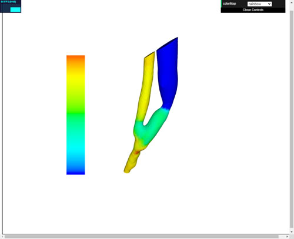

# webgl_geometry_convex

webgl/geometry/webgl_geometry_convex

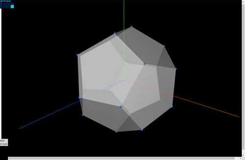

# webgl_geometry_cube

webgl/geometry/webgl_geometry_cube

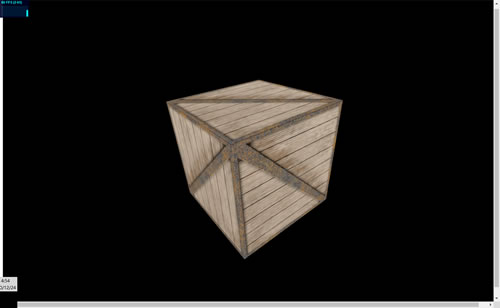

# webgl_geometry_dynamic

webgl/geomerty/webgl_geometry_dynamic

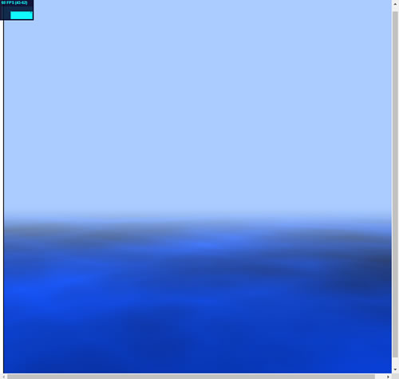

# webgl_geometry_extrude_shapes

webgl/geomerty/webgl_geometry_extrude_shapes

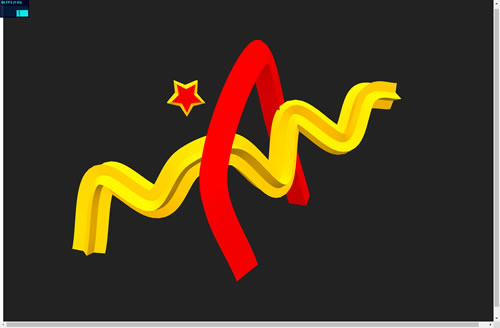

# webgl_geometry_extrude_shapes2

webgl/geomerty/webgl_geometry_extrude_shapes2

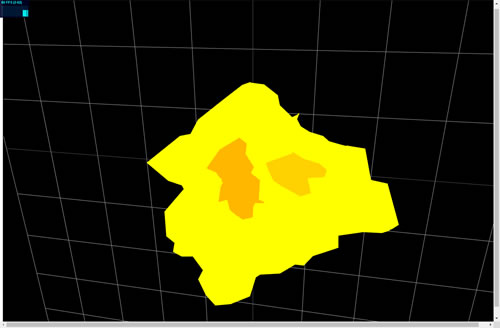

# webgl_geometry_extrude_splines

webgl/geometry/webgl_geometry_extrude_splines

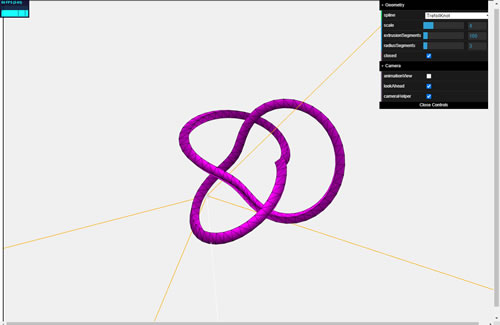

# webgl_geometry_hierarchy

webgl/geometry/webgl_geometry_hierarchy

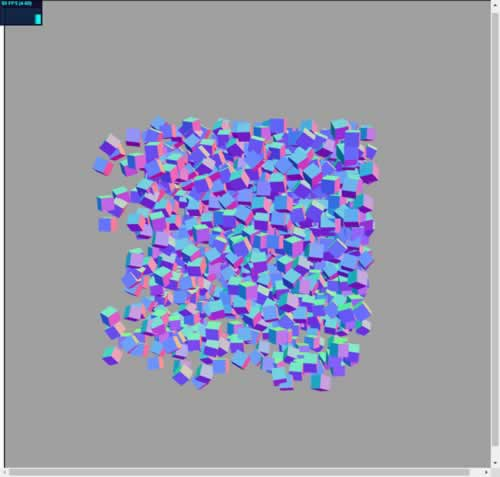

# webgl_geometry_hierarchy2

webgl/geometry/webgl_geometry_hierarchy2

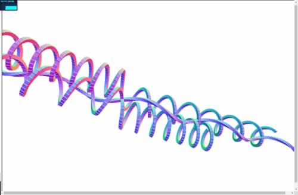

# webgl_geometry_minecraft

webgl/geometry/webgl_geometry_minecraft

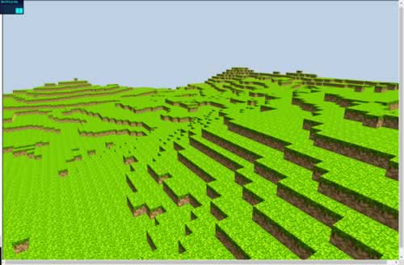

# webgl_geometry_minecraft_ao

webgl/geometry/webgl_geometry_minecraft_ao

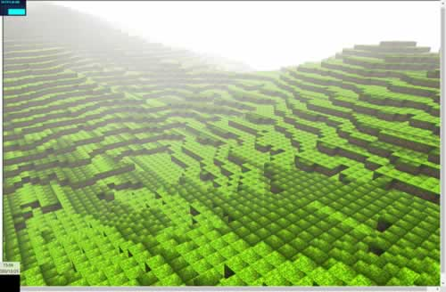

# webgl_geometry_normals

webgl/geometry/webgl_geometry_normals

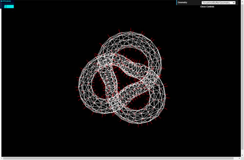

# webgl_geometry_nurbs

webgl/geometry/webgl_geometry_nurbs

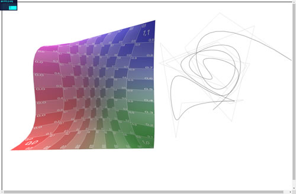

# webgl_geometry_shapes

webgl/geometry/webgl_geometry_shapes

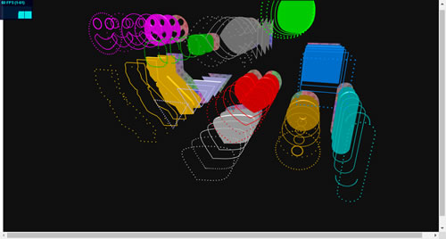

# webgl_geometry_spline_editor

webgl/geometry/webgl_geometry_spline_editor

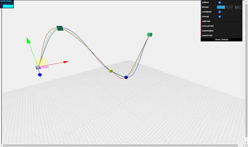

# webgl_geometry_teapot

webgl/geometry/webgl_geometry_teapot

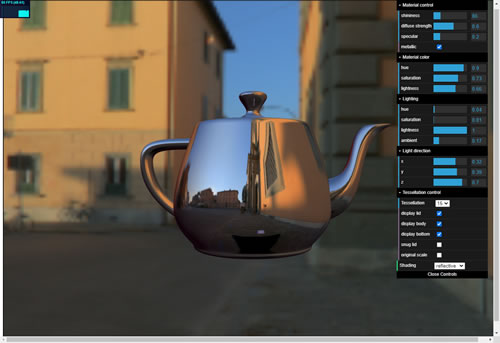

# webgl_geometry_terrain

webgl/geometry/webgl_geometry_terrain

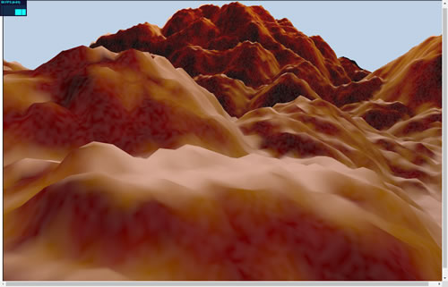

# webgl_geometry_terrain_fog

webgl/geometry/webgl_geometry_terrain[DemoFog]


# webgl_geometry_terrain_raycast

webgl/geometry/webgl_geometry_terrain[DemoRaycast]

# webgl_geometry_text

webgl/geometry/webgl_geometry_text


# webgl_geometry_text_shapes

webgl/geometry/webgl_geometry_text_shapes

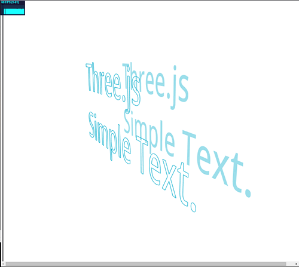

# webgl_geometry_text_stroke

webgl/geometry/webgl_geometry_text_stroke

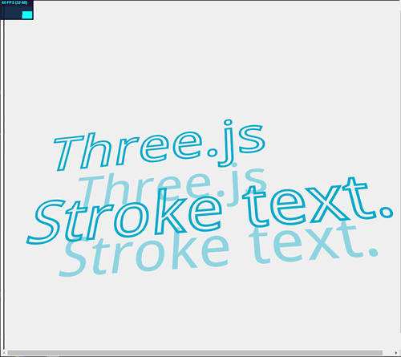

# webgl_helpers

webgl/helpers/webgl_helpers

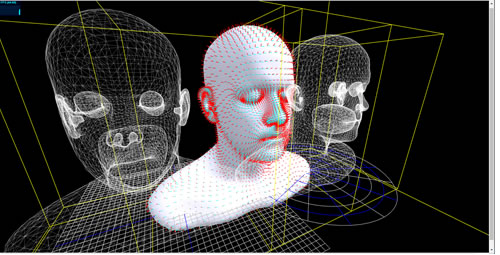

# webgl_instancing_dynamic

webgl/instancing/webgl_instancing_dynamic

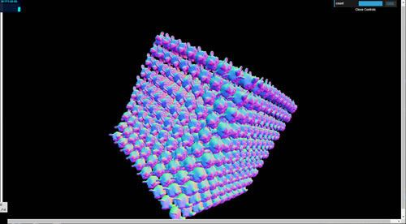

# webgl_instancing_performance

webgl/instancing/webgl_instancing_performance

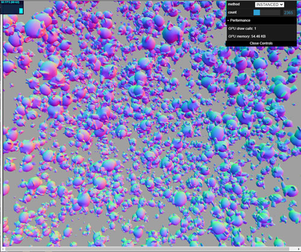

# webgl_instancing_raycast

webgl/instancing/webgl_instancing_raycast

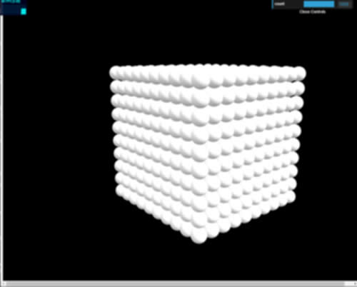

# webgl_instancing_scatter

webgl/instancing/webgl_instancing_scatter

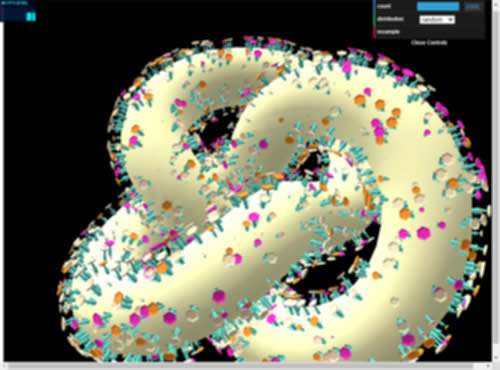

# webgl_interactive_buffergeometry

webgl/interactive/webgl_interactive_buffergeometry

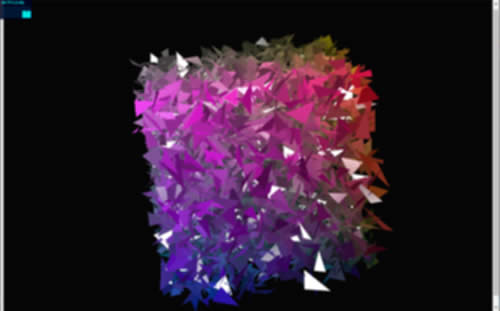

# webgl_interactive_cubes

webgl/interactive/webgl_interactive_cubes

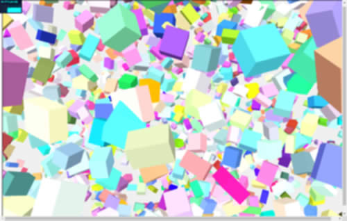

# webgl_interactive_cubes_gpu

webgl/interactive/webgl_interactive_cubes_gpu

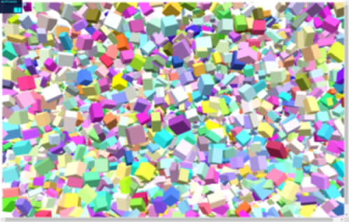

# webgl_interactive_cubes_ortho

webgl/interactive/webgl_interactive_cubes_ortho

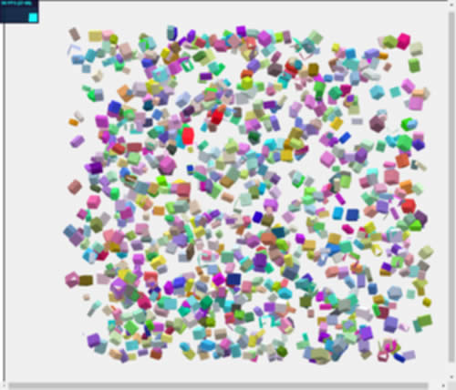

# webgl_interactive_lines

webgl/interactive/webgl_interactive_lines

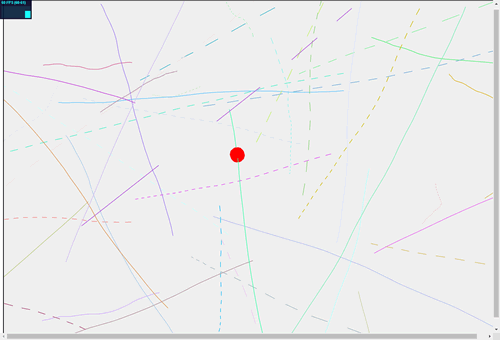

# webgl_interactive_points

webgl/interactive/webgl_interactive_points


# webgl_interactive_raycasting_points

webgl/interactive/webgl_interactive_raycasting_points


# webgl_interactive_voxelpainter

webgl/interactive/webgl_interactive_voxelpainter


# webgl_layers


# webgl_lensflares


# webgl_lightprobe

webgl/lightprobe/webgl_lightprobe


# webgl_lightprobe_cubecamera

webgl/lightprobe/webgl_lightprobe_cubecamera


# webgl_lights_hemisphere

webgl/lights/webgl_lights_hemisphere


# webgl_lights_physical

需要网盘资源

webgl/lights/webgl_lights_physical


# webgl_lights_pointlights

webgl/lights/webgl_lights_pointlights


# webgl_lights_pointlights2

webgl/lights/webgl_lights_pointlights2


# webgl_lights_spotlight

webgl/lights/webgl_lights_spotlight


# webgl_lights_spotlights

webgl/lights/webgl_lights_spotlights


# webgl_lights_rectarealight

webgl/lights/webgl_lights_rectarealight


# webgl_lines_colors

webgl/lines/webgl_lines_colors


# webgl_lines_dashed

webgl/lines/webgl_lines_dashed


# webgl_lines_fat

webgl/lines/webgl_lines_fat


# webgl_lines_fat_wireframe

webgl/lines/webgl_lines_fat_wireframe


# webgl_lines_sphere

webgl/lines/webgl_lines_sphere


# webgl_loader_3dm

需要网盘资源

webgl/loader/webgl_loader_3dm


# webgl_loader_3ds

webgl/loader/webgl_loader_3ds


# webgl_loader_3mf

webgl/loader/webgl_loader_3mf

需要网盘资源


# webgl_loader_3mf_materials

webgl/loader/webgl_loader_3mf_materials

需要网盘资源


# webgl_loader_amf

webgl/loader/webgl_loader_amf


# webgl_loader_assimp

webgl/loader/webgl_loader_assimp


# webgl_loader_bvh

webgl/loader/webgl_loader_bvh


# webgl_loader_collada

webgl/loader/webgl_loader_collada


# webgl_loader_collada_kinematics

webgl/loader/webgl_loader_collada_kinematics


# webgl_loader_collada_skinning

webgl/loader/webgl_loader_collada_skinning


# webgl_loader_draco

webgl/loader/webgl_loader_draco


# webgl_loader_fbx

webgl/loader/webgl_loader_fbx


# webgl_loader_fbx_nurbs

webgl/loader/webgl_loader_fbx_nurbs


# webgl_loader_gcode

webgl/loader/webgl_loader_gcode


# webgl_loader_gltf

webgl/loader/webgl_loader_gltf


# webgl_loader_gltf_extensions

webgl/loader/webgl_loader_gltf_extensions


# webgl_loader_gltf_variants

webgl/loader/webgl_loader_gltf_variants


# webgl_loader_imagebitmap

webgl/loader/webgl_loader_imagebitmap


# webgl_loader_kmz

webgl/loader/webgl_loader_kmz


# webgl_loader_ldraw

webgl/loader/webgl_loader_ldraw


# webgl_loader_lwo

webgl/loader/webgl_loader_lwo


# webgl_loader_md2

webgl/loader/webgl_loader_md2


# webgl_loader_md2_control

webgl/loader/webgl_loader_md2_control


# webgl_loader_mdd

webgl/loader/webgl_loader_mdd


# webgl_loader_mmd

webgl/loader/webgl_loader_mmd


# webgl_loader_mmd_pose

webgl/loader/webgl_loader_mmd_pose


# webgl_loader_mmd_audio

webgl/loader/webgl_loader_mmd_audio


# webgl_loader_nrrd

webgl/loader/webgl_loader_nrrd


# webgl_loader_obj

webgl/loader/webgl_loader_obj


# webgl_loader_obj_mtl

webgl/loader/webgl_loader_obj_mtl


# webgl_loader_pcd

webgl/loader/webgl_loader_pcd


# webgl_loader_pdb

webgl/loader/webgl_loader_pdb


# webgl_loader_ply

webgl/loader/webgl_loader_ply


# webgl_loader_prwm

webgl/loader/webgl_loader_prwm


# webgl_loader_stl

webgl/loader/webgl_loader_stl


# webgl_loader_svg

webgl/loader/webgl_loader_svg


# webgl_loader_tilt

webgl/loader/webgl_loader_tilt


# webgl_loader_texture_basis

webgl/loader/webgl_loader_texture_basis


# webgl_loader_texture_dds

webgl/loader/webgl_loader_texture_dds


# webgl_loader_texture_exr

webgl/loader/webgl_loader_texture_exr


# webgl_loader_texture_hdr

webgl/loader/webgl_loader_texture_hdr


# webgl_loader_texture_ktx

webgl/loader/webgl_loader_texture_ktx


# webgl_loader_texture_ktx2

webgl/loader/webgl_loader_texture_ktx2


# webgl_loader_texture_lottie

webgl/loader/webgl_loader_texture_lottie


# webgl_loader_texture_pvrtc

webgl/loader/webgl_loader_texture_pvrtc

pvrtc 仅限iOS

# webgl_loader_texture_rgbm

webgl/loader/webgl_loader_texture_rgbm


# webgl_loader_texture_tga

webgl/loader/webgl_loader_texture_tga


# webgl_loader_ttf

webgl/loader/webgl_loader_ttf


# webgl_loader_vox

webgl/loader/webgl_loader_vox


# webgl_loader_vrm

webgl/loader/webgl_loader_vrm


# webgl_loader_vrml

webgl/loader/webgl_loader_vrml


# webgl_loader_vtk

webgl/loader/webgl_loader_vtk


# webgl_loader_x

webgl/loader/webgl_loader_x


# webgl_loader_xyz

webgl/loader/webgl_loader_xyz


# webgl_lod


# webgl_marchingcubes


# webgl_materials

webgl/materials/webgl_materials


# webgl_materials_blending

webgl/materials/webgl_materials_blending


# webgl_materials_blending_custom

webgl/materials/webgl_materials_blending_custom


# webgl_materials_bumpmap

webgl/materials/webgl_materials_bumpmap


# webgl_materials_car

webgl/materials/webgl_materials_car


# webgl_materials_channels

webgl/materials/webgl_materials_channels


# webgl_materials_cubemap

webgl/materials/webgl_materials_cubemap


# webgl_materials_cubemap_balls_reflection

webgl/materials/webgl_materials_cubemap_balls_reflection


# webgl_materials_cubemap_dynamic


# webgl_materials_cubemap_refraction


# webgl_materials_cubemap_mipmaps


# webgl_materials_curvature


# webgl_materials_displacementmap


# webgl_materials_envmaps(未开始)

未开始

# webgl_panorama_cube


# webgl_panorama_equirectangular


可以通过拖入图片改变场景.


```bash
# 首次运行先生成 dll
npx webpack --config webpack.dll.config.js
# 开启 webpack 测试服务器
npx webpack-dev-server
```

# brunch 运行的项目:

```bash
brunch new -s threeJS

npm start
```

# webgl_framebuffer_texture

