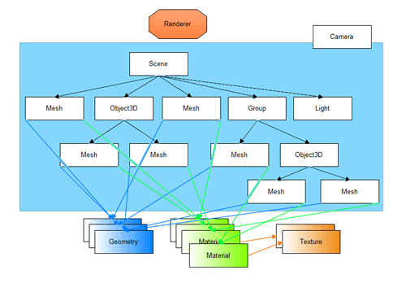
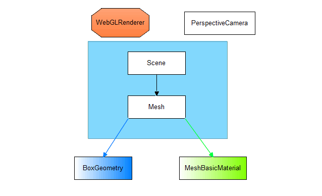
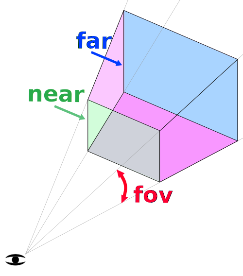
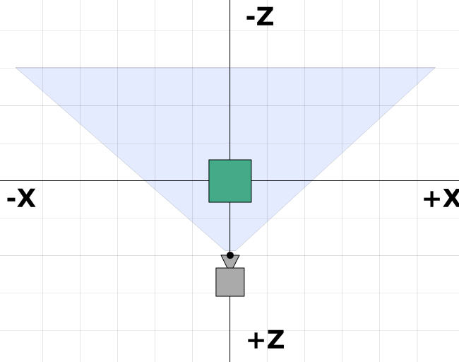
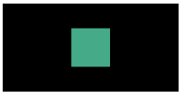
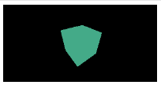
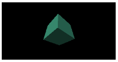
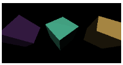
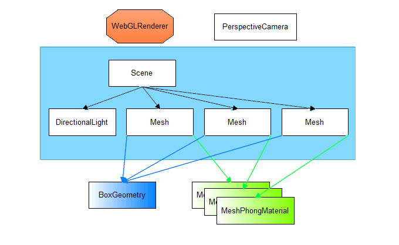

[link](https://threejsfundamentals.org/threejs/lessons/zh_cn/)

```bash
# 首次运行先生成 dll
npx webpack --config webpack.dll.config.js
# 开启 webpack 测试服务器
npx webpack-dev-server
```


# Basics

## 1. three.js 基础

three.js 经常会和 WebGL 混淆, WebGL 是一个只能画点, 线和三角形的非常底层的系统. 想要用 WebGL 来做一些实用的东西通常需要大量的代码, 而这时就是 three.js 的用武之地了, three.js 其实是使用 WebGL 来绘制三维效果的, 但它还封装了诸如场景, 灯光, 阴影, 材质, 贴图, 空间运算等一系列功能, 让你不必要再从底层 WebGL 开始写起.

three.js 应用需要创建很多对象, 并且将他们关联在一起. 下图是一个基础的 three.js 应用结构:



- 首先有一个渲染器(Renderer). 这可以说是 three.js 的主要对象, 需要传入一个场景(Scene)和一个摄像机(Camera)到渲染器中, 然后它会将摄像机视椎体(frustum)中的三维场景渲染成一个二维图片显示到画布(Canvas)上.

- 其次有一个场景图, 它是一个树状结构, 包含了很多对象. 比如上图中的场景包含了一个场景(Scene)对象, 多个网格(Mesh)对象, 光源(Light)对象, 群组(Group), 三维物体(Object3D), 和摄像机(Camera)对象. 一个场景(Scene)对象定义了场景图最基本的要素, 并包含了背景(backgroud)和雾(fog)等属性. 这些对象通过一个层级关系明确的树状结构来展示出各自的位置和方向. 子对象的位置和方向总是相对于父对象而言的. 比如说汽车的轮子是汽车的子对象, 这样移动和定位汽车时, 也会自动移动轮子.

  注意图中的摄像机(Camera)是一半在场景图中, 一半在场景图外的. 这表示在 three.js 中, 摄像机(Camera)对象和其他对象不同的是, 它不一定要在场景图中才能起作用. 相同的是, 当摄像机(Camera)作为其他对象的子对象时, 同样会继承它的父对象的位置和朝向.

- 网格(Mesh)对象可以理解为用一种特定的材质(Material)来绘制的一个特定的几何体(Geometry). 材质(Material)和几何体(Geometry)可以被多个网格(Mesh)对象使用. 比如在不同的位置画两个蓝色立方体, 会需要两个网格(Mesh)对象来代表每一个立方体的位置和方向. 但只需一个几何体(Geometry)来存放立方体的顶点数据, 和一种材质(Material)来定义立方体的颜色为蓝色就可以了. 两个风格(Mesh)对象都引用了相同的几何体(Geometry)和材质(Material).

- 几何体(Geometry)对象顾名思义代表一些几何体, 如球体, 立方体, 平面, 狗, 猫, 人, 树, 建筑等物体的顶点信息. three.js 内置了许多基本几何体. 你也可以创建自定义的几何体或从文件中加载几何体.

- 材质(Material)对象代表绘制几何体表面的属性, 包括使用的颜色, 光亮程度等. 一个材质(Material)可以引用一个或多个纹理(Texture), 纹理可以简单理解为包裹到几何体的表面的图像.

- 纹理(Texture)对象通常表示一幅要么从文件中加载, 要么在画布(Canvas)上生成, 要么由另一个场景渲染出的图像.

- 光源(Light)对象代表不同种类的光.

学习大多数编程语言的时候, 第一件事就是打印输出一个 "Hello World!". 对于三维来说, 第一件事往往就是创建一个三维的立方体. 所以有了以上基本概念后, 就来画个下图所示的 "Hello Cube"吧.




three.js 需要使用 Canvas 标签来绘制, 所以要先创建并获取它然后传给 three.js.

```typescript
const canvas = document.createElement('canvas');
document.body.appendChild(canvas); // 也可以是 HTML 中已有的 canvas 标签, 通过 document.querySelector 获取后传给 three.js
const renderer = new THREE.WebGLRenderer({ canvas });
```

拿到 canvas 后, 需要创建一个 WebGL渲染器(WebGLRenderer). 渲染器负责将你之后提供的所有数据渲染绘制到 canvas 上. 之前还有其他渲染器, 比如 *CSS 渲染器*(CSSRenderer), *Canvas 渲染器*(CanvasRenderer). 将来可能会有 *WebGL2 渲染器*(WebGL2Renderer)或 *WebGUP 渲染器*(WebGPURenderer). 目前在 three.js 中我们会使用 *WebGL 渲染器*(WebGLRenderer), 它将通过 WebGL 将三维空间渲染到 canvas 上.

注意这里的一个细节. 如果没有给 three.js 传递 canvas, three.js 会自己创建一个, 但此时就需要你手动将它添加到 DOM 中. 如下:

```typescript
const renderer = new THREE.WebGLRenderer();
document.body.appendChild(renderer.domElement); // 必须将 three.js 自己创建的 canvas 添加到 DOM 中.
```

接下来我们需要一个透视摄像机(PerspectiveCamera).

```typescript
const fov = 75;
const aspect = 2; // 相机默认值
const near = 0.1;
const far = 5;
const camera = new THREE.PerspectiveCamera(fov, aspect, near, far);
```

- fov: 是视野范围(field of view)的缩写, 上述代码中是指垂直方向为75度. 注意, three.js 中大多数的角用弧度表示, 但是因为某些原因, 透视摄像机使用角度表示.
- aspect: 是指定画布的宽高比, 默认情况下画布是300x150像素, 所以宽高比为300/150或者说为2.
- near 和 far: 代表近平面和远平面, 它们限制了摄像机面朝方向的可绘区域. 任何距离小于或超过这个范围的物体都将被裁剪掉(不绘制).

这四个参数定义了一个视椎(frustum). 视椎(frustum)是指一个像被削去顶部的金字塔形状. 换句话说, 可以把视椎(frustum)想象成其他三维形状如球体, 立方体, 棱柱体, 截椎体.



近平面和远平面的高度由视野范围决定, 宽度由视野范围和宽高比决定.

视椎体内部的物体将被绘制, 视椎体外的东西将不会被绘制.

摄像机默认指向Z轴负方向, 上方向朝向Y轴正方向. 默认我们会把立方体放置在坐标原点, 所以我们需要往后移一下摄像机才能显示出物体. 例如:



```typescript
camera.position.z = 2;
```

我们看到摄像机的位置在 `z = 2`. 它朝向Z轴负方向. 我们的视椎体范围是从摄像机前方0.1到5. 因为这张图是俯视图, 视野范围会受到宽高比的影响. 画布的宽度是高度的两倍, 所以水平视角会比我们设置的垂直视角75度要大.

然后我们创建一个场景(Scene). 场景(Scene)是 three.js 的基本的组成部分. 需要 three.js 绘制的东西都需要加入到场景中.

```typescript
const scene = new THREE.Scene();
```

然后创建一个包含盒子信息的立方几何体(BoxGeometry). 几乎所有希望在 three.js 中显示的物体都需要一个包含了组成三维物体的顶点信息的几何体.

```typescript
const boxWidth = 1;
const boxHeight = 1;
const boxDepth = 1;
const geometry = new THREE.BoxGeometry(boxWidth, boxHeight, boxDepth);
```

然后创建一个基本的材质并设置它的颜色, 颜色的值可以用 css 方式和十六进制来表示.

```typescript
const material = new THREE.MeshBasicMaterial({ color: 0x44aa88 });
```

再创建一个网格(Mesh)对象, 它包含了:

1. 几何体(Geometry): 物体的形状.
2. 材质(Material): 如果绘制物体, 光滑还是平整, 什么颜色, 什么贴图等等.
3. 对象在场景中相对于它父对象的位置, 朝向和缩放.

```typescript
const cube = new THREE.Mesh(geometry, material);
```

最后我们将网格添加到场景中.

```typescript
scene.add(cube);
```

之后将场景和摄像机传递给渲染器来渲染出整个场景.

```typescript
renderer.render(scene, camera);
```



这时很难看出来这是一个三维的立方体, 因为我们是直视Z轴的负方向, 并且立方体和坐标轴是对齐的, 所以我们只能看到一个面.

我们来让立方体旋转起来, 以便更好的在三维环境中显示. 为了让它动起来我们需要用到一个渲染循环函数 `reqeustAnimationFrame`.

```typescript
function render(time: number) {
    time *= 0.001; // 时间单位从毫秒变为秒

    cube.rotation.x = time;
    cube.rotation.y = time; // 旋转角度是弧度制的, 一圈的弧度为2∏, 所以立方体每个方向旋转一周的时间为6.28秒左右.

    renderer.render(scene, camera);

    requestAnimationFrame(render); // 调用另一个帧动画继续循环.
}
requestAnimationFrame(render);// 开始渲染循环.
```



效果好了一些, 但还是很难看出是三维的. 现在添加一些光照效果, 让效果更明显一些.

先创建一个平行光.

```typescript
const color = 0xffffff;
const intensity = 1;
const light = new THREE.DirectionalLight(color, intensity);
light.position.set(-1, 2, 4);
scene.add(light);
```

平行光有一个位置和目标点, 默认值都为(0, 0, 0). 我们现在把灯光的位置设为(-1, 2, 4), 让它位于摄像机前面稍微左上方一点的地方. 目标点还是(0, 0, 0), 让它朝向坐标原点方向.

另外还需要改变一下立方体的材质. MeshBasicMaterial 材质不会受到灯光的影响. 现在将它改为会受灯光影响的 MeshPhongMaterial 材质.

```diff
- const material = new THREE.MeshBasicMaterial({ color: 0x44aa88 });
+ const material = new THREE.MeshPhongMaterial({ color: 0x44aa88 });
```

这是新的项目结构:




现在可以很清楚的看出是三维立方体了.

最后我们再添加两个立方体来增添点趣味性. 每个立方体会引用同一个几何体和不同的材质, 这样每个立方体将会是不同的颜色.

[代码: 1.2.ts](1/1.2.ts)



现在的项目有了这样的结构:



我们有三个网格(Mesh)引用了相同的立方几何体(BoxGeometry). 每个网格(Mesh)引用一个单独的MeshPhongMaterial材质来显示不同的颜色.

## 2. 响应式设计

本篇是关于如何让 three.js 应用自适应各种情况. 网页的响应式是指让其在桌面, 平板及手机等不同尺寸的屏幕上显示良好.

在上一节的例子中, 我们使用了一个没有设置样式和尺寸的 canvas, 这个 canvas 默认是 300x150 像素. 在 web 平台, 推荐使用 CSS 来设置尺寸.

通过添加 CSS 来让 canvas 填充整个页面.

```css
html, body {
    margin: 0;
    height: 100%;
}
canvas {
    width: 100%;
    height: 100%;
    display: block;
}
```

HTML 中的 body 默认有5个像素的 margin 值, 所以设置 margin 为 0. 设置 html 和 body 的高度为 100% 让它们充满整个窗口. 不然的话, 它们的大小只会和填充他们的内容一样.

然后我们让 canvas 的尺寸是容器(body)的100%. 最后设置它的 display 为 block. canvas 的 display 默认为 inline. 行内元素的未尾会有空格. 通过设置 canvas 为块级元素就能消除这个空格.

此时 canvas 充满了整个页面, 但此时有两个问题, 一个是立方体被拉伸了, 它们看起来不像立方体更像是个盒子, 太高或太宽了. 

另一个问题是立方体看起来分辨率太低或者说块状化或者有点模糊.

首先先解决拉伸的问题, 为此我们需要将相机的宽高比设置为 canvas 的宽高比. 我们可以通过 canvas 的 clientWidth 和 clientHeight 属性来实现.

```typescript
camera.aspect = canvas.clientWidth / canvas.clientHeight;
camera.updateProjectionMatrix();
// 立方体将不会变形了
```

接下来解决块状化的问题.

canvas 元素有两个尺寸, 一个是 canvas 在页面上的显示尺寸, 是我们使用 CSS 来设置的. 另一个尺寸是 canvas 本身像素的数量. 这和图片是一样的, 比如我们有一个本身是 128x64 像素的图片, 然后我们可以通过 CSS 让它显示为 400x200 像素. 此时图片也会显示的模糊或者说块状化.

在一个 canvas 的内部有一个尺寸, 它被叫做分辨率. 通常也被叫做绘图缓冲区(drawingbuffer)尺寸. 在 three.js 中我们可以通过调用 `renderer.setSize`来设置 canvas 的绘图缓冲区. 我们应该选择什么尺寸? 最简单的应该是和 canvas 的显示尺寸一样, 即直接使用 canvas 的 clientWidth 和 clientHeight 属性.

接下来写一个函数用来检查渲染器和 canvas 分辨率是不是和 canvas 的显示尺寸不一样, 如果不一样就重新设置它.

```typescript
function resizeRendererToDisplaySize(renderer: THREE.WebGLRenderer) {
    const canvas = renderer.domElement;
    const width = canvas.clientWidth;
    const height = canvas.clientHeight;
    const needResize = canvas.width !== width || canvas.height !== height;
    if (needResize) {
        renderer.setSize(width, height, false);
    }
    return needResize;
}
```

要注意的调整画布大小前, 需要检查是否真的需要调整大小, 如果它已经是我们想要的大小了, 最好不要设置相同的大小.

一旦确实需要调整大小了, 我们就调用 `renderer.setSize`传入新的宽高. 第三个参数传入 `false`很重要. `renderer.setSize`默认会设置 canvas 的 CSS 尺寸, 但这一般并不是我们想要的. 我们还是希望浏览器能继续使用 CSS 来定义尺寸, 而不是被 three.js 影响.

另外我们可以根据 `resizeRendererToDisplaySize`的返回值来检查是否有其他的东西需要更新, 比如上面的 canvas 的显示尺寸的变化, 只有在这个函数返回 `true`时, 才需要重新设置摄像机的宽高比.

```diff
+ if (resizeRendererToDisplaySize(renderer)) {
    camera.aspect = canvas.clientWidth / canvas.clientHeight;
    camera.updateProjectionMatrix();
+ }
```

### 应对 HD-DPI 显示器

HD-DPI 代表每英寸高密度点显示器(视网膜显示器). 它指的是当今大多数的 Mac 和 Windows 机器以及几乎所有的智能手机.

浏览器中的工作方式是不管屏幕的分辨率有多高, 使用 CSS 像素设置尺寸会被认为是一样的. 同样的物理尺寸浏览器会渲染出字体的更多细节.

使用 three.js 有多种方法来应对 HD-DPI.

第一种就是不做任何特别的事情. 这可以说是最常见的. 因为渲染三维图形需要大量的 GPU 处理能力. 移动端的 GPU 能力比桌面端的要弱. 截止到 2018年, 手机都有非常高的分辨率显示器. 目前最好的手机的 HD-DPI 比例为 3x, 意味着非高密度点显示器上的一个像素在高密度显示器上是9个像素. 这就意味着需要9倍的渲染能力. 这对于大型的 three.js 应用来说, 会导致帧率降低.

如果确实需要使用设备的分辨率来渲染, three.js 中有两种方法来实现.

一种是使用 `renderer.setPixelRatio`来告诉 three.js 分辨率的倍数, 通过访问浏览器中的设备像素的倍数然后传给 three.js.

```js
renderer.setPixelRatio(window.devicePixelRatio);
// 之后任何的 renderer.setSize 的调用都会神奇地使用你传入的大小乘以像素比例
```

另一种方法是在调整 canvas 的大小时自己处理.

```diff
function resizeRendererToDisplaySize(renderer: THREE.WebGLRenderer) {
     const canvas = renderer.domElement;
+    const pixelRatio = window.devicePixelRatio;
-    const width = canvas.clientWidth;
+    const width = (canvas.clientWidth * pixelRatio) | 0;
-    const height = canvas.clientHeight;
+    const height = (canvas.clientHeight * pixelRatio) | 0;
     const needResize = canvas.width !== width || canvas.height !== height;
     if (needResize) {
         renderer.setSize(width, height, false);
     }
     return needResize;
}
```

这种方法从客观上来说会更好, 因为这样可以拿到 canvas 的绘图缓冲区的确切尺寸. 比如制作后期处理滤镜, 操作着色器时访问 gl_FragCoord 变量, 截屏或给 GPU 读取像素, 绘制到二维的 canvas时, 一般我们都需要知道自己使用的尺寸.

# Fundamentals

## 3. 图元

three.js 有很多图元. 图元就是一些 3D 的形状, 在运行时根据大量参数生成.

使用图元是种很常见的做法, 像使用球体作为地球, 或者使用大量盒子来绘制 3D 图形. 对于大多数 3D 应用来说, 更常见的做法是让美术在 3D 建模软件中创建 3D 模型, 像 Blender, Maya 或者 Cinema4D.

在之后的章节中会创建和加载来自 3D 建模软件的模型, 现在先仅使用基本的图元.


# Tips

# Optimization

# Solutions

# WebVR

# Reference