[link](https://webglfundamentals.org/webgl/lessons/zh_cn/)

```bash
# 首次运行先生成 dll
npx webpack --config webpack.dll.config.js
# 开启 webpack 测试服务器
npx webpack-dev-server
```

# 基础概念

## 一. WebGL 基础概念

WebGL 经常被当成 3D API, 人们总想"我可以使用 WebGL 和一些神奇的东西做出炫酷的 3D 作品". 事实上 WebGL 仅仅是一个光栅化引擎, 它可以根据你的代码绘制出点, 线和三角形. 想要利用 WebGL 完成更复杂任务, 取决于你能否提供合适的代码, 组合使用点, 线和三角形代替实现.

WebGL 在电脑的 GPU 中运行. 因此你需要使用能够在 GPU 上运行的代码. 这样的代码需要提供成对的方法. 每对方法中一个叫顶点着色器, 另一个叫片断着色器, 并且使用一种和 C 或 C++ 类似的强类型的语言 GLSL (GL 着色语言). 每一对组合起来称作一个 program (着色程序).

顶点着色器的作用是计算顶点的位置. 根据计算出的一系列顶点位置, WebGL 可以对点, 线和三角形在内的一些图元进行光栅化处理. 当对这些图元进行光栅化处理时需要使用片断着色器方法. 片断着色器的作用是计算出当前绘制图元中每个像素的颜色值.

几乎整个 WebGL API 都是关于如何设置这些成对方法的状态值以及运行它们. 对于想要绘制的每个对象, 都需要先设置一系列状态值, 然后通过 `gl.drawArrays`或 `gl.drawElements`运行一个着色方法对, 使得着色器对能够在 GPU 上运行.

这些方法对所需的任何数据都需要发送到 GPU,  这里有着色器获取数据的4种方法.

1. 属性(Attributes)和缓冲

   缓冲是发送到 GPU 的一些二进制数据序列, 通常情况下缓冲数据包括位置, 法向量, 纹理坐标, 顶点颜色值等. 你可以用来存储任何数据.

2. 全局变量(Uniforms)

   全局变量在着色程序运行前赋值, 在运行过程中全局有效.

3. 纹理(Textures)

   纹理是一个数据序列, 可以在着色程序运行中随意读取其中的数据. 大多数情况存放的是图像数据, 但是纹理仅仅是数据序列, 你也可以随意存放除了颜色数据以外的其它数据.

4. 可变量(Varyings)

   可变量是一种顶点着色器给片断着色器传值的方式, 依照渲染的图元是点, 线还是三角形, 顶点着色器中设置的可变量会在片断着色器运行中获取不同的插值.

#### WebGL Hello World

WebGL 只关心两件事, 裁剪空间中的坐标值和颜色值. 使用 WebGL 只需要给它提供这两个东西. 你需要提供两个着色器来做这两件事, 一个顶点着色器提供裁剪空间坐标值, 一个片断着色器提供颜色值.

要注意, 无论你的画布有多大, 裁剪空间的坐标范围永远是-1到1.

##### 初始化代码

###### 1. 顶点着色器

```glsl
// 一个属性值, 将会从缓冲中获取数据
attribute vec4 a_position;

// 所有着色器都有一个 main 方法
void main() {
  // gl_Position 是一个顶点着色器主要设置的变量
  gl_Position = a_position;
}
```

如果用 JavaScript 代替 GLSL, 当它运行时, 它做了类似的事情:

```js
// 伪代码
const positionBuffer = [
    0, 0, 0, 0,
    0, 0.5, 0, 0,
    0.7, 0, 0, 0,
];
const attributes = {};
let gl_Position;

function drawArrays(..., offset, count) {
    const stride = 4;
    const size = 4;
    for(let i = 0; i < count; i++) {
        // 从 positionBuffer 复制接下来的4个值给a_position属性
        const start = offset + i * stride;
        attributes.a_position = positionBuffer.slice(start, start + size);
        runVertexShader(); // 运行顶点着色器
        
        doSomethingWith_gl_Position();
    }
}
```

实际情况没有这么简单, 因为 `positionBuffer`将会被转换成二进制数据, 所以真实情况下从缓冲中读取数据会有些麻烦, 这个例子只是用来参考顶点着色器是怎么执行的.

###### 2. 片断着色器

```glsl
// 片断着色器没有默认精度, 需要设置一个精度
// mediump 代表 "medium precision" 中等精度
precision mediump float;

void main() {
  // gl_FragColor 是一个片断着色器主要设置的变量
  gl_FragColor = vec4(1, 0, 0.5, 1); // 红紫色
}
```

这里我们设置 `gl_FragColor`为 `1, 0, 0.5, 1`它们分别代表红色, 绿色, 蓝色和阿尔法通道值. 在 WebGL 中的颜色范围从 0 到 1.

有了两个着色器方法后, 就可以开始使用 WebGL 了.

###### 3. 创建 WebGL 渲染上下文 (WebGLRenderingContext)

首先需要一个 canvas (画布)对象, 并从中创建一个 WebGL 渲染上下文.

```js
const canvas = WebGLUtils.createCanvas();
const gl = canvas.getContext('webgl');
if (!gl) {
  // 不能使用 WebGL!
}
```

###### 4. 编译着色器并提交到 GPU

获得 gl 后, 需要编译着色器然后提交到 GPU. 着色器的代码本质上就是字符串, 你可以通过利用 JavaScript 创建字符串的方式创建 GLSL 字符串, 用 AJAX, 用多行文本数据等都可以.

事实上, 大多数三维引擎是在运行时利用模板, 串联等方式创建 GLSL 的. 本例中不需要这么复杂.

```js
// 编译顶点着色器
const vertexShader = WebGLUtils.compileShader(gl, vertex, gl.VERTEX_SHADER);
// 编译片断着色器
const fragmentShader = WebGLUtils.compileShader(gl, fragment, gl.FRAGMENT_SHADER);
```

###### 5. 将两个着色器链接到一个着色程序

```js
const program = WebGLUtils.createProgram(gl, vertexShader, fragmentShader);
```

现在我们已经在 GPU 上创建了一个 GLSL 着色程序, 我们还需要给它提供数据. WebGL 的主要任务就是设置好状态并为 GLSL 着色程序提供数据. 

###### 6. 寻找属性位置

在这个例子中, GLSL 着色程序的唯一输入是一个属性值 `a_position`, 所以接下来做的第一件事就是从刚才创建的 GLSL 着色程序中找到这个属性值所在的位置.

```js
const positionAttributeLocation = gl.getAttribLocation(program, 'a_position');
```

寻找属性位置应该在初始化的时候完成, 而不是在渲染循环中.

###### 7. 创建缓冲

属性值是从缓冲中获取数据的, 所以要创建一个缓冲.

```js
const positionBuffer = gl.createBuffer();
```

###### 8. 绑定缓冲

WebGL 通过绑定点来操控全局范围内的数据, 你可以把绑定点想象成一个 WebGL 内部的全局变量. 首先绑定一个数据源到绑定点, 然后可以引用绑定点指向该数据源. 绑定位置信息缓冲 (下面的绑定点就是 `ARRAY_BUFFER`).

```js
gl.bindBuffer(gl.ARRAY_BUFFER, positionBuffer);
```

###### 9. 通过绑定点向缓冲中存放数据

```js
const positions = [
    0, 0, 
    0, 0.5, 
    0.7, 0,
];
gl.bufferData(gl.ARRAY_BUFFER, new Float32Array(positions), gl.STATIC_DRAW);
```

这里首先有一个 JavaScript 数组的 `positions`, 因为 WebGL 需要强类型数据, 所以用 `new Float32Array(positions)`创建了 32 位浮点型数据序列, 并从 `positions`中复制数据到序列中, 然后 `gl.bufferData`复制这些数据到 GPU 的 `positionBuffer`对象上. 它最终会传递到 `positionBuffer`上是因为在前一步已经将它绑定到 `ARRAY_BUFFER`这个绑定点上了.

最后一个参数 `gl.STATIC_DRAW`是提示 WebGL 我们将怎么使用这些数据. WebGL 会根据提示做出一些优化. `gl.STATIC_DRAW`提示 WebGL 我们不会经常改变这些数据.

以上的代码是**初始化代码**, 这些代码在页面加载时只会运行一次, 接下来的代码是**渲染代码**, 这些代码需要在每次渲染或者绘制时执行.

##### 渲染代码

###### 10. 调整画布尺寸

在绘制之前, 我们应该调整画布的尺寸以匹配它的显示尺寸(画布和图片一样有两个尺寸, 一个是它拥有的实际像素个数, 另一个是它显示的大小). 应该尽可能的使用 CSS 设置所需画布的显示大小, 因为它相对其他方式更灵活.

```js
WebGLUtils.resizeCanvasToDisplaySize(canvas, true);
```

###### 11. 裁剪空间坐标对应到画布像素坐标

```js
gl.viewport(0, 0, gl.canvas.width, gl.canvas.height);
```

这样等于告诉 WebGL 裁剪空间的 `-1 -> +1` 分别对应到 x 轴的 `0 -> gl.canvas.width`和 y 轴的 `0 -> gl.canvas.height`.

###### 12. 清空画布

```js
gl.clearColor(0, 0, 0, 0);
gl.clear(gl.COLOR_BUFFER_BIT);
```

###### 13. 运行着色程序

```js
gl.useProgram(program);
```

###### 14. 告诉 WebGL 怎么从缓冲中获取数据给着色器中的属性

首先要启用对应的属性

```js
gl.enableVertexAttribArray(positionAttributeLocation);
```

然后指定从缓冲中读取数据的方式

```js
// 将绑定点绑定到缓冲数据
gl.bindBuffer(gl.ARRAY_BUFFER, positionBuffer);

// 告诉属性怎么从 positionBuffer 中读取数据 (ARRAY_BUFFER)
const size = 2; // 每次迭代运行提取两个单位数据
const type = gl.FLOAT; // 每个单位数据类型是 32位浮点型
const normalize = false; // 不需要归一化数据
const stride = 0; // 0 = 移动单位数量 * 每个单位占用内存 (sizeof(type)), 即每次迭代运行运行多少内存到下一个数据开始点
let offset = 0; // 从缓冲起始位置开始读取
gl.vertexAttribPointer(
    positionAttributeLocation,
    size,
    type,
    normalize,
    stride,
    offset
);
```

一个隐藏信息是, `gl.vertexAttribPointer`是将属性绑定到当前的 `ARRAY_BUFFER`. 换句话说, 就是属性绑定到了 `positionBuffer`上. 这就意味着, 在这之后即使将绑定点 `ARRAY_BUFFER`绑定到其他数据上, 该属性 `positionAttributeLocation`依然是从 `positionBuffer`上读取数据的.

要注意在 GLSL 的顶点着色器中的 `a_position`属性的数据类型是 `vec4`, `vec4`是一个有四个浮点数据的数据类型, 在 JavaScript 中可以把它想象成 `a_position = {x:0, y:0, z:0, w:0}`. 之前设置了 `size = 2`, 由于属性的默认值是 `0,0,0,1`, 所以属性将会从缓冲中获取前两个值(x和y), z和w还会是默认值0和1.

###### 15. 运行 GLSL 着色程序

```js
const primitiveType = gl.TRIANGLES; // 图元类型
offset = 0;
const count = 3;
gl.drawArrays(primitiveType, offset, count);
```

因为 `count = 3`, 所以顶点着色器将会运行三次, 每次从缓冲中读取两个值赋值给属性 `a_position.x`和 `a_position.y`

另外因为我们设置了图元类型为 `gl.TRIANGLES(三角形)`, 顶点着色器每运行三次, WebGL 将会根据三个 `gl_Position`值绘制一个三角形, 并且不论画布大小是多少, 在裁剪空间中每个方向的坐标范围都是 -1 到 1.

WebGL 将会把顶点着色器中的值转换到屏幕空间上, 所以如果画布大小是 400x300, 我们会得到类似以下的转换.

```
裁剪空间			屏幕空间
0  , 0		->		200, 150
0  , 0.5	->		200, 225
0.7, 0		->		340, 150
```

现在 WebGL 将渲染出这个三角形, 绘制每个像素时, WebGL 都会调用片断着色器, 因为片断着色器只是简单设置 `gl_FragColor = vec4(1, 0, 0.5, 1) `, 由于画布每个通道宽度为8位, 这表示 WebGL 最终在画布上会绘制 `rgba(255, 0, 127, 255)`.

上例中, 顶点着色器只是简单的传递了位置信息, 如果想做三维渲染, 其实需要提供合适的着色器将三维坐标转换到裁剪空间坐标上, 因为 WebGL 只是一个光栅化 API.

#### 像素坐标转换到裁剪空间

[代码](./webglhelloworldp/index.ts)

WebGL 认为左下角是 0, 0. 如果想像传统二维 API 那样起点在左上角, 只需要翻转 y 轴即可.

```diff
- gl_Position = vec4(clipSpace, 0, 1);
+ gl_Position = vec4(clipSpace * vec2(1, -1), 0, 1);
```

#### 随机位置, 随机大小, 随机颜色的矩形

[代码](./webglhelloworld2/index.ts)

## 二. WebGL 工作原理

WebGL 在 GPU 上的工作基本上分为两部分, 第一部分是将顶点 (或数据流)转换到裁剪空间坐标, 第二部分是基于第一部分的结果绘制像素点.

当你调用:

```js
const primitiveType = gl.TRIANGLES;
const offset = 0;
const count = 9;
gl.drawArrays(primitiveType, offset, count);
```

这里的9表示"处理9个顶点", 所以将会有9个顶点被转换.


左侧是你提供的数据, 中间的顶点着色器 (Vertex Shader) 是你写进 GLSL 的一个方法, 每个顶点调用一次, 在这个方法中做一些数学运算后设置到一个特殊的 `gl_Position`变量, 这个变量就是该顶点转换到裁剪空间中的坐标值, GPU 接收该值并将其保存起来.

假设你正在画三角形, 顶点着色器每完成三次顶点处理, WebGL 就会用这三个顶点画一个三角形. 它计算出这三个顶点对应的像素后, 就会光栅化这个三角形, "光栅化"其实就是"用像素画出来"的花哨叫法. 对于每一个像素, 它会调用你的片断着色器询问你需要使用什么颜色, 通过给片断着色器中的一个特殊变量 `gl_FragColor`设置颜色值, 将实现自定义像素颜色.

使用它们可以做出非常有趣的东西, 到目前为止的例子中, 处理每个像素时片断着色器可用的信息很少, 幸运的是可以给它传递更多信息, 想要从顶点着色器传值到片断着色器, 可以定义"可变量 (varyings)".

### 从顶点着色器传值到片断着色器

[代码](./2/index.ts)

首先在顶点着色器定义一个 varying(可变量)用来给片断着色器传值.

```glsl
attribute vec2 a_position;
uniform mat3 u_matrix;
varying vec4 v_color;

void main() {
    gl_Position = vec4((u_matrix * vec3(a_position, 1)).xy, 0, 1);

    // 从裁减空间转换到颜色空间
    // 裁判空间范围 -1.0 到 +1.0
    // 颜色空间范围 0.0 到 1.0
    v_color = gl_Position * 0.5 + 0.5;
}
```

然后在片断着色器中定义同名 varying(可变量).

```glsl
precision mediump float;

varying vec4 v_color;

void main() {
    gl_FragColor = v_color;
}
```

WebGL 会将同名的可变量从顶点着色器输入到片断着色器中.

要注意的是, 我们只计算了三个顶点, 调用了三次顶点着色器, 所以也只计算出了三个颜色值, 但是最终显示的三角形却有很多颜色, 这就是称之为可变量 varying 的原因.

WebGL 先获得顶点着色器中计算的三个颜色值, 在光栅化三角形时将会根据这三个值进行插值. 每一个像素在调用片断着色器时, 可变量的值是与之对应的插值.

顶点

| x    | y    |
| ---- | ---- |
| 0    | -100 |
| 150  | 125  |
| -175 | 100  |

写入 gl_Position 的值

| x      | y      |
| ------ | ------ |
| 0.000  | 0.660  |
| 0.750  | -0.830 |
| -0.875 | -0.660 |

写入 v_color 的值

| r      | g     | b    |
| ------ | ----- | ---- |
| 0.5000 | 0.830 | 0.5  |
| 0.8750 | 0.086 | 0.5  |
| 0.0625 | 0.170 | 0.5  |

最后利用这三个值进行插值后传进每个像素运行的片断着色器中.

[2D代码模拟](2-fragment-shader-anim/index.ts)

### 从外部(JS)传值到片断着色器

如果想要直接通过 JavaScript 传值给片断着色器, 可以先把值传递给顶点着色器, 然后由顶点着色器再传给片断着色器.

[代码](2-1/index.ts)

```typescript
function setColors(gl: WebGLRenderingContext) {
    const [r1, b1, g1, r2, b2, g2] = [0, 0, 0, 0, 0, 0].map((v) => Math.random());

    gl.bufferData(
        gl.ARRAY_BUFFER,
        new Float32Array([
            r1,b1,g1,1,
            r1,b1,g1,1,
            r1,b1,g1,1,
            r2,b2,g2,1,
            r2,b2,g2,1,
            r2,b2,g2,1
        ]),
        gl.STATIC_DRAW
    );
}
// 需要给每个顶点传一个颜色值, 因为传给每个三角形的点的颜色是相同的, 所以插值结果就是相同的颜色. 只需要给每个顶点传递不同的颜色, 就可以看到插值的颜色了.

function setColors(gl: WebGLRenderingContext) {
    const [r1, b1, g1, r2, b2, g2] = [0, 0, 0, 0, 0, 0].map((v) => Math.random());

    gl.bufferData(
        gl.ARRAY_BUFFER,
        new Float32Array([ // 每个顶点都随机一个颜色
            Math.random(), Math.random(), Math.random(), 1,
            Math.random(), Math.random(), Math.random(), 1,
            Math.random(), Math.random(), Math.random(), 1,
            Math.random(), Math.random(), Math.random(), 1,
            Math.random(), Math.random(), Math.random(), 1,
            Math.random(), Math.random(), Math.random(), 1,
        ]),
        gl.STATIC_DRAW
    );
}

```

### 关于 buffer 和 attribute 的代码是干什么的?

缓冲操作是在 GPU 上获取顶点和其他顶点数据的一种方式. `gl.createBuffer`创建一个缓冲. `gl.bindBuffer`是设置缓冲为当前使用的缓冲. `gl.bufferData`会将数据拷贝到缓冲, 这个操作一般在初始化时完成.

一旦数据存到缓冲中, 还需要告诉 WebGL 怎么从缓冲中提取数据传给顶点着色器的属性.

要做这些, 首先需要获取 WebGL 给属性分配的地址:

```js
// 询问顶点数据应该放在哪里
const positionLocation = gl.getAttribLocation(program, 'a_position');
```

一旦知道了属性的地址, 在绘制前还需要发出三个命令:

```js
gl.enableVertexAttribArray(location); // 告诉 WebGL 我们想从缓冲中提供数据.

gl.bindBuffer(gl.ARRAY_BUFFER, someBuffer); // 将缓冲绑定到 ARRAY_BUFFER 绑定点, 它是 WebGL 内部的一个全局变量

gl.vertexAttribPointer(location, numComponents, typeOfData, normalizeFlag, strideToNextPieceOfData, offsetIntoBuffer);
// 告诉 WebGL 从 ARRAY_BUFFER 绑定点当前绑定的缓冲中获取数据. (将从 ARRAY_BUFFER 绑定点绑定的 buffer 中获取数据放到 location 里)
// 每个顶点有几个单位的数据(1-4之间)
// 单位数据类型是什么(BYTE, FLOAT, INT, UNSIGNED_SHORT 等)
// 是否标准化
// 每个数据之间要跳过多少位
// 数据在缓冲的超始位置
```

如果每个类型的数据都用一个缓冲存储, stride 和 offset 都是 0. 

对于 stride 来说, 0 表示用符合单位类型和单位个数的大小. 

对于 offset 来说, 0 表示从缓冲起始位置开始读取.

标准化标记 (normalizeFlag)适用于所有非浮点型数据. 如果传递 false 就解读原数据类型. BYTE 类型的范围是从 -128 到 127, UNSIGNED_BYTE 类型的范围是从 0 到 255, SHORT 类型的范围是从 - 32768 到 32767 等等.

如果设置为 true, 所有类型都会被转换到 -1.0 到 +1.0 之间. (UNSIGNED_BYTE 则变成 0.0 到 +1.0 之间).

最常用的标准化数据是颜色, 大多数情况颜色值范围为 0.0 到 +1.0. 如果使用4个浮点型数据存储颜色, 每个顶点的颜色将会占用 16 字节空间, 如果转换为使用4个 UNSIGNED_BYTE, 则每个顶点只需要4字节存储颜色, 省了 75% 空间.

```js
gl.vertexAttribPointer(colorLocation, 4, gl.UNSIGNED_BYTE, true, 0, 0);

// 这些数据在存入缓冲时将被截取成 Uint8Array 类型
const r1 = Math.random() * 256;
const g1 = Math.random() * 256;
const b1 = Math.random() * 256;
const r2 = Math.random() * 256;
const g2 = Math.random() * 256;
const b2 = Math.random() * 256;

gl.bufferData(gl.ARRAY_BUFFER, new Uint8Array([
    r1, b1, g1, 255,
    r1, b1, g1, 255,
    r1, b1, g1, 255,
    r2, b2, g2, 255,
    r2, b2, g2, 255,
    r2, b2, g2, 255,
]), gl.STATIC_DRAW);
```

## 三. WebGL 着色器和 GLSL

WebGL 每次绘制需要两个着色器, 一个顶点着色器和一个片断着色器, 每一个着色器都是一个方法. 一个顶点着色器和一个片断着色器链接在一起放入一个着色程序中. 一个典型的 WebGL 应用会有多个着色程序.

### 顶点着色器

一个顶点着色器的工作是生成裁剪空间坐标值, 通常是以下的形式:

```glsl
void main() {
    gl_Position = doMathToMakeClipspaceCoordinates;
}
```

每个顶点调用一次顶点着色器, 每次调用都需要设置一个特殊的全局变量 `gl_Position`, 该变量的值就是裁减空间坐标值.

顶点着色器需要的数据, 可以通过以下三种方式获得.

1. Attributes 属性: 从缓冲中获取的数据.
2. Uniforms 全局变量: 在一次绘制中对所有顶点保持一致值.
3. Textures 纹理: 从像素或纹理元素中获取的数据.

#### Attributes 属性

最常用的方法是缓冲和属性.

创建缓冲:

```js
const buf = gl.createBuffer(); 
```

将数据存入缓冲:

```js
gl.bindBuffer(gl.ARRAY_BUFFER, buf);
gl.bufferData(gl.ARRAY_BUFFER, someData, gl.STATIC_DRAW);
```

在初始化时, 从着色器程序中找到属性所在地址:

```js
const positionLoc = gl.getAttribLocation(someShaderProgram, 'a_position');
```

在渲染时告诉 WebGL 怎么从缓冲中获取数据传递给属性:

```js
// 开启从缓冲中获取数据
gl.enableVertexAttribArray(positionLoc);

const numComponents = 3; // (x, y, z)
const type = gl.FLOAT; // 32位浮点数据
const normalize = false; // 不标准化
const offset = 0; // 从缓冲起始位置开始获取
const stride = 0; // 到下一个数据跳多少位内存
// 0 = 表示使用当前单位个数和单位长度 (3 * Float32Array.BYTES_PER_ELEMENT)
gl.vertexAttribPointer(positionLoc, numComponents, type, false, stride, offset);
```

最后将数据传递给 `gl_Position`:

```glsl
attribute vec4 a_position;

void main() {
    gl_Position = a_position;
}
```

属性可以用 `float, vec2, vec3, vec4, mat2, mat3, mat4`数据类型.

#### Uniforms 全局变量

全局变量在一次绘制过程中传递给着色器的值都是一样的.

在上一个例子的基础上, 给顶点着色器添加一个偏移量:

```glsl
attribute vec4 a_position;
uniform vec4 u_offset;

void main() {
    gl_Position = a_position + u_offset;
}
```

先找到全局变量的地址:

```js
const offsetLoc = gl.getUniformLocation(someProgram, 'u_offset');
```

然后在绘制前设置全局变量:

```js
gl.uniform4fv(offsetLoc, [1, 0, 0, 0]); // 向右偏移一半屏幕宽度
```

要注意的是全局变量属于单个着色程序, 如果有多个着色程序有相同的全局变量, 需要找到每个全局变量并设值. 每次调用 `gl.uniform???`时, 只会设置**当前着色程序**的全局变量, **当前着色程序**是指传递给 `gl.useProgram`的最后一个程序.

全局变量有很多类型, 对应的类型有对应的设置方法.

```js
gl.uniform1f (floatUniformLoc, v);                 // float
gl.uniform1fv(floatUniformLoc, [v]);               // float 或 float array
gl.uniform2f (vec2UniformLoc,  v0, v1);            // vec2
gl.uniform2fv(vec2UniformLoc,  [v0, v1]);          // vec2 或 vec2 array
gl.uniform3f (vec3UniformLoc,  v0, v1, v2);        // vec3
gl.uniform3fv(vec3UniformLoc,  [v0, v1, v2]);      // vec3 或 vec3 array
gl.uniform4f (vec4UniformLoc,  v0, v1, v2, v4);    // vec4
gl.uniform4fv(vec4UniformLoc,  [v0, v1, v2, v4]);  // vec4 或 vec4 array

gl.uniformMatrix2fv(mat2UniformLoc, false, [  4x element array ])  // mat2 或 mat2 array
gl.uniformMatrix3fv(mat3UniformLoc, false, [  9x element array ])  // mat3 或 mat3 array
gl.uniformMatrix4fv(mat4UniformLoc, false, [ 16x element array ])  // mat4 或 mat4 array

gl.uniform1i (intUniformLoc,   v);                 // int
gl.uniform1iv(intUniformLoc, [v]);                 // int 或 int array
gl.uniform2i (ivec2UniformLoc, v0, v1);            // ivec2
gl.uniform2iv(ivec2UniformLoc, [v0, v1]);          // ivec2 或 ivec2 array
gl.uniform3i (ivec3UniformLoc, v0, v1, v2);        // ivec3
gl.uniform3iv(ivec3UniformLoc, [v0, v1, v2]);      // ivec3 or ivec3 array
gl.uniform4i (ivec4UniformLoc, v0, v1, v2, v4);    // ivec4
gl.uniform4iv(ivec4UniformLoc, [v0, v1, v2, v4]);  // ivec4 或 ivec4 array

gl.uniform1i (sampler2DUniformLoc,   v);           // sampler2D (textures)
gl.uniform1iv(sampler2DUniformLoc, [v]);           // sampler2D 或 sampler2D array

gl.uniform1i (samplerCubeUniformLoc,   v);         // samplerCube (textures)
gl.uniform1iv(samplerCubeUniformLoc, [v]);         // samplerCube 或 samplerCube array
```

##### 数组

一个数组可以一次设置所有的全局变量.

```js
// 着色器里
uniform vec2 u_someVec2[3];

// JavaScript 初始化时
const someVec2Loc = gl.getUniformLocation(someProgram, 'u_someVec2');

// 渲染时, 设置数组 u_someVec2
gl.uniform2fv(someVec2Loc, [1, 2, 3, 4, 5, 6]);
```

如果想单独设置数组中的某个值, 就要单独找到该值的地址.

```js
// JavaScript 初始化时
const someVec2Element0Loc = gl.getUniformLocation(someProgram, 'u_someVec2[0]');
const someVec2Element1Loc = gl.getUniformLocation(someProgram, 'u_someVec2[1]');
const someVec2Element2Loc = gl.getUniformLocation(someProgram, 'u_someVec2[2]');

// 渲染时
gl.uniform2fv(someVec2Element0Loc, [1, 2]); // set element 0
gl.uniform2fv(someVec2Element1Loc, [3, 4]); // set element 1
gl.uniform2fv(someVec2Element2Loc, [5, 6]); // set element 2
```

##### 结构体

在顶点着色器中还可以创建一个结构体:

```glsl
struct SomeStruct {
    bool active;
    vec2 someVec2;
};
uniform SomeStruce u_someThing;
```

这时在 JavaScript 需要找到每个元素的地址:

```js
const someThingActiveLoc = gl.getUniformLocation(someProgram, 'u_someThing.active');
const someThingSomeVec2Loc = gl.getUniformLocation(someProgram, 'u_someThing.someVec2');
```

#### Textures 纹理

同片断着色器中的 Textures 纹理.

### 片断着色器

一个片断着色器的工作是为当前光栅化的像素提供颜色值, 通常是以下的形式:

```glsl
precision mediump float;

void main() {
    gl_FragColor = doMathToMakeAColor;
}
```

每个像素都将调用一次片断着色器, 每次调用需要会从特殊的全局变量 `gl_FragColor`中获取颜色信息.

片断着色器所需的数据, 可以通过以下三种方式获取.

1. Uniforms 全局变量: 在一次绘制中, 所有像素保持相同的值.
2. Textures 纹理: 从像素或纹理元素中获取的数据.
3. Varyings 可变量: 从顶点着色器传递过来并进行插值的数据.

#### Uniforms 全局变量

同顶点着色器中的 Uniforms 全局变量.

#### Textures 纹理

先创建一个 `sampler2D`类型的全局变量, 然后用 GLSL 的方法 `texture2D`从纹理中提取信息.

```glsl
precision mediump float;

uniform sampler2D u_texture;

void main() {
    vec2 texcoord = vec2(0.5, 0.5); // 中心点
    gl_FragColor = texture2D(u_texture, texcoord); // 获取纹理中心的值
}
```

从纹理中获取的数据取决于很多设置, 至少需要创建并给纹理填充数据.

```js
const tex = gl.createTexture();
gl.bindTexture(gl.TEXTURE_2D, tex);

const level = 0;
const width = 2;
const height = 1;
const data = new Uint8Array([
    255, 0, 0, 255, // 一个红色的像素
    0, 255, 0, 255, // 一个绿色的像素
]);
gl.texImage2D(gl.TEXTURE_2D, level, gl.RGBA, width, height, 0, gl.RGBA, gl.UNSIGNED_BYTE, data);
```

然后在初始化时找到全局变量的地址:

```js
const someSamplerLoc = gl.getUniformLocation(someProgram, 'u_texture');
```

在渲染的时候, WebGL 要求纹理必须绑定到一个纹理单元上:

```js
const unit = 5; // 挑选一个纹理单元
gl.activeTexture(gl.TEXTURE0 + unit);
gl.bindTexture(gl.TEXTURE_2D, tex);
```

最后告诉着色器你要使用的纹理在哪个纹理单元中.

```js
gl.uniform1i(someSamplerLoc, unit);
```

#### Varyings 可变量

可变量是一种顶点着色器给片断着色器传值的方式.

为了使用可变量, 要在两个着色器中定义同名的可变量. 然后给顶点着色器中可变量设置的值, 会作为参考值进行内插, 在绘制像素时传给片断着色器的可变量.

顶点着色器

```glsl
attribute vec4 a_position;
uniform vec4 u_offset;
varying vec4 v_positionWithOffset;

void main() {
    gl_Position = a_position + u_offset;
    v_positionWithOffset = a_position + u_offset;
}
```

片断着色器

```glsl
precision mediump float;

varying vec4 v_positionWithOffset;

void main() {
    // 从裁剪空间(-1 -> +1) 转换到颜色空间(0 -> 1)
    vec4 color = v_positionWithOffset * 0.5 + 0.5;
    gl_FragColor = color;
}
```

### GLSL

GLSL 全称是 Graphics Library Shader Language (图形库着色器语言), 是着色器使用的语言. 它有一些不同于 JavaScript 的特性, 主要目的是为栅格化图形提供常用的计算功能. 所以它内建的数据类型例如 `vec2`, `vec3`和 `vec4`分别代表两个值, 三个值和四个值, 类似的还有 `mat2`, `mat3`和 `mat4`分别代表 2x2, 3x3 和 4x4 矩阵. 你可以做一些运算例如常量和矢量的乘法.

```glsl
vec4 a = vec4(1, 2, 3, 4);
vec4 b = a * 2.0;
// b 现在是 vec4(2, 4, 6, 8);
```

同样也可以做矩阵乘法以及矢量和矩阵的乘法

```glsl
mat4 a = ???;
mat4 b = ???;
mat4 c = a * b;

vec4 v = ???;
vec4 y = c * v;
```

对矢量数据还提供多种分量选择器, 例如 vec4:

- v.x 和 v.s 以及 v.r, v[0] 表达的是同一个分量.
- v.y 和 v.t 以及 v.g, v[1] 表达的是同一个分量.
- v.z 和 v.p 以及 v.b, v[2] 表达的是同一个分量.
- v.w 和 v.q 以及 v.a, v[3] 表达的是同一个分量.

它还支持矢量调制, 意味着你可以交换或重复分量.

```glsl
v.yyyy;
vec4(v.y, v.y, v.y, v.y);
// 是一样的

v.bgra;
vec4(v.b, v.g, v.r, v.a);
// 是一样的

vec4(v.rgb, 1);
vec4(v.r, v.g, v.b, 1);
// 是一样的

vec4(1);
vec4(1, 1, 1, 1);
// 是一样的
```

GLSL 是一个强类型的语言.

```glsl
float f = 1; // 错误, 1是int类型, 不能将int型赋值给float

// 正确的方式
float f = 1.0; // 使用 float
float f = float(1); // 将 integer 转换为 float

vec4(v.rgb, 1); // 不会因为 1 报错, 因为 vec4 内部使用了类似 float(1) 进行了转换
```

GLSL 有一系列内置方法, 其中大多数运行支持多种数据类型, 并且一次可以运算多个分量, 例如:

```glsl
T sin(T angle);
// T 可以是 float, vec2, vec3, vec4

vec4 v = vec4(1, 1, 1, 1);

vec4 s = sin(v);
vec4 s = vec4(sin(v.x), sin(v.y), sin(v.z), sin(v.w));
// 是一样的

vec4 m = mix(v1, v2, f);
vec4 m = vec4(
	mix(v1.x, v2.x, f),
    mix(v1.y, v2.y, f),
    mix(v1.z, v2.z, f),
    mix(v1.w, v2.w, f)
);
// 是一样的
```

### 参考

[WebGL 引用表](assets/webgl-reference-card-1_0.pdf)

[GLSL规范](assets/opengles_shading_language.pdf)

## 四. WebGL 演示

[链接](https://webglfundamentals.org/webgl/lessons/resources/webgl-state-diagram.html)

# 图像处理

## 五. WebGL 图像处理

在 WebGL 中绘制图片需要使用纹理. 和 WebGL 渲染时需要裁剪空间坐标相似, 渲染纹理时需要纹理坐标, 而不是像素坐标. 无论纹理是什么尺寸, 纹理坐标范围始终是 0.0 到 1.0.

因为我们只用画一个矩形 (其实是两个三角形), 所以需要告诉 WebGL 矩形中每个顶点对应的纹理坐标. 我们将使用 Varying 可变量将纹理坐标从顶点着色器传到片断着色器, WebGL 会对顶点着色器中可变量的值进行插值, 然后传给对应像素执行的片断着色器.

[代码](5/index.ts)

[卷积内核](5-1/index.ts)

### 为什么 `u_image`没有设置还能正常运行?

全局变量默认为 0, 所以 u_image 默认使用纹理单元 0. 纹理单元 0 默认为当前活跃纹理, 所以调用 `bindTexture`会将纹理绑定到单元 0.

WebGL 有一个纹理单元队列, 每个 sampler 全局变量的值对应着一个纹理单元, 它会从对应的单元寻找纹理数据, 你可以将纹理设置到你想要用的纹理单元.

```js
const textureUnitIndex = 6; // 使用单元 6
const u_imageLoc = gl.getUniformLocation(program, 'u_image');
gl.uniform1i(u_imageLoc, textureUnitIndex);

// 纹理纹理到单元 6
gl.activeTexture(gl.TEXTURE6);
gl.bindTexture(gl.TEXTURE_2D, someTexture);

// 或者
gl.activeTexture(gl.TEXTURE0 + textureUnitIndex);
gl.bindTexture(gl.TEXTURE_2D, someTexture);
```

所有支持 WebGL 的环境, 在片断着色器中至少有8个纹理单元, 顶点着色器中可以是0个. 所以如果要使用超过8个纹理单元就应该调用 `gl.getParameter(gl.MAX_TEXTURE_IMAGE_UNITS)`查看单元个数, 或者调用 `gl.getParameter(gl.MAX_VERTEX_TEXTURE_IMAGE_UNITS)`查看顶点着色器中可以用几个纹理单元. 超过 99% 的机器在顶点着色器中至少有4个纹理单元.

### 在 GLSL 中为什么变量的前缀都是 `a_`, `u_`或 `v_`?

这只是一个命名约定, `a_`代表属性, 值从缓冲中提供. `u_`代表全局变量, 直接使用 API 进行设置. `v_`代表可变量, 是从顶点着色器的顶点中插值出来的.

## 六. WebGL 进一步处理图像

图像处理的下一个问题是如何同时施加多种效果?

可以试着在运行时创建着色器, 根据用户从交互界面选择的一些效果, 创建一个可以全部实现的着色器, 但是大部分情况下是不适合的.

一个更灵活的方式是使用2个或以上的纹理, 然后交替渲染它们, 像乒乓球一样每次渲染一种效果, 传给另一个渲染下一个效果.

```
原始图像	->[模糊]	->纹理 1
纹理 1	->[锐化]	->纹理 2
纹理 2	->[边缘检测]	->纹理 1
纹理 1	->[模糊]	->纹理 2
纹理 2	->[平滑]	->画布
```

这个操作需要使用帧缓冲来实现. 在 WebGL 和 OpenGL 中, 帧缓冲是一个糟糕的名字. WebGL/OpenGL 中的帧缓冲只是一系列状态, 但在绑定一个纹理后, 可以将渲染结果写入那个纹理.

[代码](6/index.ts)

调用 `gl.bindFramebuffer`设置为 `null`是告诉 WebGL 要在画布上绘制, 而不是在帧缓冲上.

# 二维

## 七. WebGL 二维平移

平移就是普通意义的"移动"物体.

假设我们想要平移一个由六个三角形组成的 'F', 像这样:

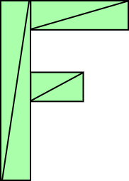

可以这样写:

```js
function setGeometry(gl, x, y) {
    const width = 100;
    const height = 150;
    const thickness = 30;
    gl.bufferData(gl.ARRAY_BUFFER, new Float32Array([
        // 左竖
        x,y,
        x+thinckness,y,
        x,y+height,
        x,y+height,
        x+thickness,y,
        x+thickness,y+height,
        
        // 上横
        x+thickness,y,
        x+width,y,
        x+thickness,y+thickness,
        x+thickness,y+thickness,
        x+width,y,
        x+width,y+thickness,
        
        // 中横
        x+thickness,y+thickness*2,
        x+width*2/3,y+thickness*2,
        x+thickness,y+thickness*3,
        x+thickness,y+thickness*3,
        x+width*2/3,y+thickness*2,
        x+width*2/3,y+thickness*3
    ]), gl.STATIC_DRAW);
}
```

这样做会有一个问题, 如果我们想绘制一个含有成百上千个线条的几何图形, 将会有很复杂的代理, 最重要的是, 每次绘制 JavaScript 都要更新所有的点.

更好的方案是将平移代码放进顶点着色器:

```glsl
attribute vec2 a_position;

uniform vec2 u_resolution;
// 平移坐标
uniform vec2 u_translation;

void main() {
    // 整体平移
    vec2 position = a_position + u_translation;
    vec2 zeroToOne = position / u_resolution;
    vec2 zeroToTwo = zeroToOne * 2.0;
    vec2 clipSpace = zeroToTwo - 1.0;

    gl_Position = vec4(clipSpace * vec2(1, -1), 0, 1);
}
```

[代码](7/index.ts)

## 八. WebGL 二维旋转

二维旋转首先要了解"单位圆"的东西, 即有一个圆, 它的半径为1.0.

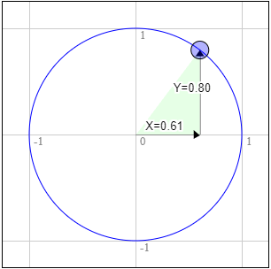

二维旋转即如上图在单位元上取一点, 然后将该点的 X 和 Y 与几何体相乘.

```js
// 旋转角度先转换为弧度, 然后取正弦和余弦分别就是上图中的X和Y
const angleInRadians = (angleInDegrees * Math.PI) / 180;
rotation[0] = Math.sin(angleInRadians);
rotation[1] = Math.cos(angleInRadians);
```

### 弧度是什么?

弧度是圈, 旋转和角度的一个单位. 就像可以用英尺, 米, 码等单位来表示距离一样, 我们可以用角度或弧度来测量角.

弧度和角度的对比类似国家测量单位和皇家测量单位的对比. 从英寸到英尺要乘以12, 从英寸到码要乘以36, 要进行心算时就会非常麻烦, 但是国际单位就好用的多, 从千米到米只需要乘以1000.

所以类似的, 圆的一圈用角度计算不容易, 因为它是360度, 但用弧度表示就很简单就是 2π. 所以一半就是 1π 弧度, 90度就是 1/2π 弧度. 如果想旋转90度, 只需要使用 `Math.PI * 0.5`, 45度只需要使用 `Math.PI * 0.25`.

## 九. WebGL 二维缩放

位置乘以期望的缩放值. 当缩放值为负数时, 会翻转显示.

## 十. WebGL 二维矩阵

之前对二维物体进行了平移, 旋转和缩放. 每种变换都会改变着色器, 并且这些变换还受先后顺序的影响. 

例如, 这是缩放 `[2,1]`, 旋转30度, 然后平移 `[100,0]`的结果.

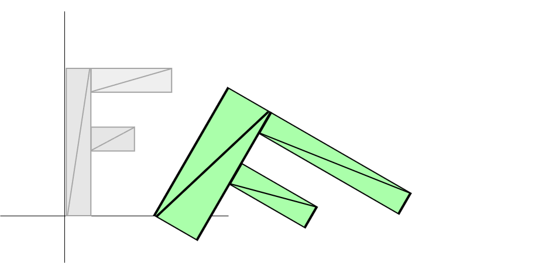

这是平移 `[100,0]`, 旋转30度, 然后缩放 `[2,1]`的结果.

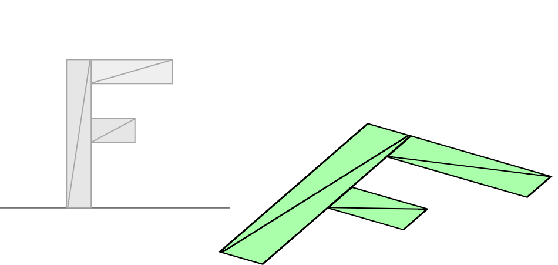

结果截然不同, 如果要实现第二种转换顺序, 就需要重新写一个新的着色器.

要解决不同转换顺序就要重新写一个新的着色器这个问题, 就会使用到矩阵. 对于二维来说, 会使用 3x3 的矩阵. 3x3 的矩阵就像是有9个格子的格网.

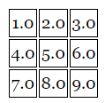

```js
newX = x * 1.0 + y * 4.0 + 1 * 7.0;
newY = x * 2.0 + y * 5.0 + 1 * 8.0;
extra = x * 3.0 + y * 6.0 + 1 * 9.0;
```

平移矩阵

假设要平移的量为 tx 和 ty.

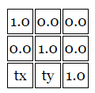

则计算结果为:

```js
newX = x * 1.0 + y * 0.0 + 1 * tx;
newY = x * 0.0 + y * 1.0 + 1 * ty;
extra = x * 0.0 + y * 0.0 + 1 * 1.0;
// 去掉0相乘的部分, 以及1相乘没有变化的部分
newX = x + tx;
newY = y + ty;
```

旋转矩阵

旋转只需要和旋转角对应的正弦和余弦值.

```js
s = Math.sin(angleToRotateInRadians);
c = Math.cos(angleToRotateInRadians);
```

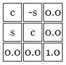

```js
newX = x * c + y * s + 1 * 0.0;
newY = x * -s + y * s + 1 * 0.0;
extra = x * 0.0 + y * 0.0 + 1 * 0.0;
// 简化后
newX = x * c + y * s;
newY = x * -s + y * c;
```

缩放矩阵

将两个缩放因子叫做 sx 和 sy.

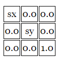

使用矩阵计算:

```js
newX = x * sx + y * 0.0 + 1 * 0.0;
newY = x * 0.0 + y * sy + 1 * 0.0;
extra = x * 0.0 + y * 0.0 + 1 * 1.0;
// 简化后
newX = x * sx;
newY = x * sy;
```

使用矩阵计算, 不同的顺序, 只需要改变矩阵相乘的顺序即可:

```js
const translationMatrix = m3.translation(tx, ty);
const rotationMatrix = m3.rotation(angleInRadians);
const scaleMatrix = m3.scaling(sx, sy);

// 矩阵相乘(multiply), 先平移, 后旋转最后缩放
let matrix = m3.multiply(translationMatrix, rotationMatrix);
matrix = m3.multiply(matrix, scaleMatrix);

// 矩阵相乘, 先缩放, 后旋转最后平移
let matrix = m3.multiply(scaleMatrix, rotationMatrix);
matrix = m3.multiply(matrix, translationMatrix);

```

另外可以通过额外的矩阵相乘, 设置旋转锚点.

```js
const moveOriginMatrix = m3.translation(-50, -75); // 设置锚点

let matrix = m3.multiply(translationMatrix, rotationMatrix);
matrix = m3.multiply(matrix, scaleMatrix);
matrix = m3.multiply(matrix ,moveOriginMatrix);
```

另外, 之前顶点着色器中将像素坐标转换到裁剪坐标的操作, 其实也是一个缩放变换.

```js
const projectionMatrix = m3.projection(canvas.clientWidth, canvas.clientHeight);
```

### 矩阵顺序理解

```js
translation * rotation * scale // 平移 * 旋转 * 缩放
```

对于上述这个矩阵顺序运算, 可以给出这样一个表达式

```js
projectionMat * translationMat * rotationMat * scaleMat * position
```

#### 1. 从右向左解释

```js
// 首先将位置乘以缩放矩阵获得缩放后的位置
scaledPosition = scaleMat * position;
// 然后将缩放后的位置和旋转矩阵相乘得到缩放旋转位置
rotatedScaledPosition = rotationMat * scaledPosition;
// 然后将缩放旋转位置和平移矩阵相乘得到缩放旋转平移位置
translatedRotatedScaledPosition = translationMat * rotatedScaledPosition;
// 最后和投影矩阵相乘得到裁剪空间中的坐标
clipspacePosition = projectionMatrix * translatedRotatedScaledPosition;
```

#### 2. 从左往右解释

第一步, 没有矩阵(或单位矩阵)

中间区域是画布, 蓝色是画布以外, 传递的点需要在裁剪空间中.

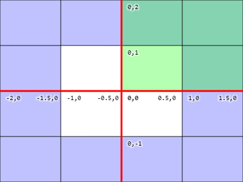

第二步, `matrix = m3.projection(canvas.clientWidth, canvas.clientHeight)`

假设像素空间是(400, 300), (0,0)点在左上角, 要注意 Y 轴作了一次上下颠倒.

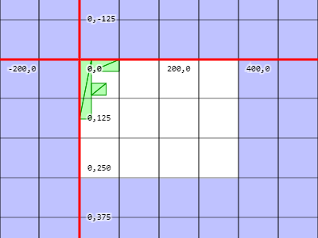

第三步, `matrix = m3.translate(matrix, tx, ty)`

原点被移动到 (tx, ty), 所以空间移动了.

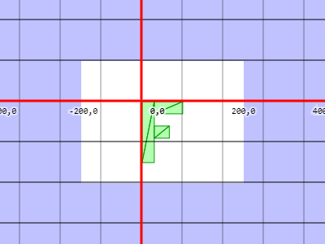

第四步, `matrix = m3.rotate(matrix, rotationInRadians)`

空间绕 tx, ty 旋转

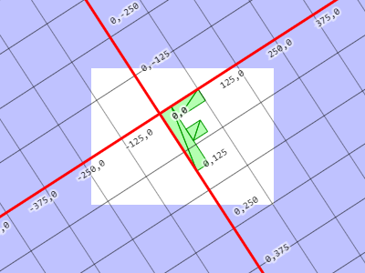

第五步, `matrix = m3.scale(matrix, sx, sy)`

在旋转空间中心的 tx, ty 处, x方向缩放2, y方向缩放1.5

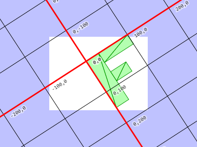

最后着色器执行 `gl_Position = matrix * position;` `position`将被直接转换到这个空间.

### `clientWidth`和 `clientHeight`是什么?

画布的显示宽高会受到页面布局的影响, 导致 `width`和 `height`并不能真实反应画布的实际尺寸. 而 `clientWidth`和 `clientHeight`返回的是画布在浏览器中实际显示的大小.

# 三维

## 十一. WebGL 三维正射投影

二维例子中是二维点(x, y) 与 3x3 的矩阵相乘. 在三维中, 则需要三维点(x, y, z)与 4x4 的矩阵相乘.

新的顶点着色器:

```glsl
attribute vec4 a_position;

uniform mat4 u_matrix;

void main() {
  gl_Position = u_matrix * a_position;
}
```

在二维中我们提供 `x`和 `y`并设置 `z`为 1, 在三维中我们会提供 `x`, `y`和 `z`, 并且将 `w`设置为 1, 由于属性中 `w`的默认值就是1, 所以可以不再显式设置.

另外要将矩阵运算升级到三维的版本, 其中旋转将化为三个旋转方法, 这是因为在二维中, 只需要绕 Z 轴旋转, 但在三维中还可以绕 X 轴和 Y 轴旋转.

```js
// 绕 Z 轴旋转
newX = x * c + y * s;
newY = x * -s + y * c;

// 绕 Y 轴旋转
newX = x * c + z * s;
newZ = x * -s + z * c;

// 绕 X 轴旋转
newY = y * c + z * s;
newZ = y * -s + z * c;
```

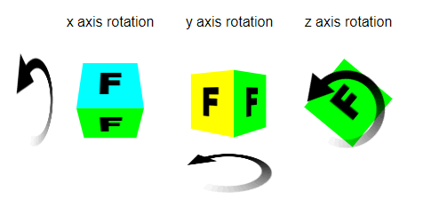

## 十二. WebGL 三维透视投影

什么是透视投影? 它的基础特性就是离得越远显得越小.

事实上 WebGL 会将提供给 `gl_Position`的 x, y, z, w 值自动除以 `w`.

```diff
-	float zToDivideBy = 1.0 + position.z * u_fudgeFactor;
-	gl_Position = vec4(position.xy / zToDivideBy, position.zw);
+      gl_Position = position;

...

+    function makeZToWMatrix(fudgeFactor: number): number[] {
+        return [1, 0, 0, 0, 0, 1, 0, 0, 0, 0, 1, fudgeFactor, 0, 0, 0, 1];
+    }

...

+    let matrix = makeZToWMatrix(fudgeFactor);
+        matrix = m4.multiply(matrix, m4.projection(canvas.clientWidth, canvas.clientHeight, 400));
-    let matrix = m4.projection(canvas.clientWidth, canvas.clientHeight, 400);
```

更好的方式是使用一个矩阵来代替 `fudgeFactor`.

```js
export function perspective(
  fieldOfViewInRadians: number,
  aspect: number,
  near: number,
  far: number
): number[] {
  const f = Math.tan(Math.PI * 0.5 - 0.5 * fieldOfViewInRadians);
  const rangeInv = 1.0 / (near - far);

  return [
    f / aspect, 0, 0, 0,
    0, f, 0, 0,
    0, 0, (near + far) * rangeInv, -1,
    0, 0, near * far * rangeInv*2,0
  ]
}
```

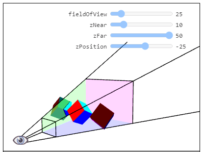

正方体所在的有四个侧面的锥体叫做"视锥", 矩阵将视锥中的空间转换成裁剪空间中, `zNear`决定了被正面切割的位置, `zFar`决定了被背面切割的位置.

## 十三. WebGL 三维相机

默认情况下, 相机放在了原点(0, 0, 0), 将物体移动到现场中可能并不是正确的方法, 在实际生活中通常是移动相机去拍摄.

通过简单的逆向矩阵可以高效的将物体移动到相机前.

看向特定的位置, 可以通过相机本身的位置和朝向计算出.

相机位置 `cameraPosition`减去看向的目标 `target`可以得到相机的朝向 `zAxis`, 最终对 `zAxis`进行 `normalize`即可.

然后在任何情况下, 可能通过叉乘 `zAxis`和 `up`得到相机的 `xAxis`.

最后叉乘 `zAxis`和 `xAxis`即可得到相机的 `yAxis`.

# 光照

## 十四. WebGL 三维方向光源

实施光照的方式有很多种, 最简单的可能就是方向光源了.

方向光是指光照均匀地来自某一个方向, 晴朗天气下的太阳经常被当作方向光源, 它距离足够远, 所以光线可以被看作是平行的照到地面上.

计算方向光非常简单, 将方向光的方向和面的朝向点乘, 就可以得到两个方向的余弦值. 当结果为1时, 表示物体朝向和光照方向相同, -1 则物体朝向和光照方向相反.

### 法向量

法向量就是描述面的朝向的单位向量.

用 `normal`和 `u_world`相乘去重向法向量时, 如果世界矩阵被缩放了, 会得到错误的法向量. 解决方法是对世界矩阵求逆并转置, 用这个矩阵就能得到正确的结果.

## 十五. WebGL 三维点光源

方向光统一来自一个方向, 如果代替方向而是从三维空间中选一个点当作光源, 然后在着色器中根据光源和表面位置计算光照方向的话, 就是点光源了.

每个点都有一个不同的面到光源的矢量, 将这个矢量和法向量点乘后, 表面上的每个点都会有一个不同的光照值.

### 镜面高光

如果物体表面恰好将光线反射到你眼前, 就会显得非常明亮, 像镜子一样.

如果入射角和反射角怕好与眼睛和光源的夹角相同, 那么光线就会反射到眼前.

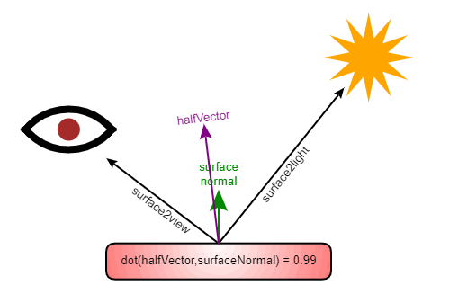

如果我们知道物体表面到光源的方向, 加上物体表面到视区/眼睛/相机的方向, 再除以 2 得到 `halfVector`向量, 将这个向量和法向量比较, 如果方向一致, 那么光线就会被反射到眼前. 如何确定方向一致? 用点乘就可以了, 1 表示相符, 0 表示垂直, -1 表示相反.

### 为什么 `power(negative, power)`是 undefined?

```js
pow(5, 2)
// 可以当作
5 * 5 = 25

pow(5, 3)
// 可以看作
5 * 5 * 5 = 125

pow(-5, 2)
// 就是
-5 * -5 = 25

pow(-5, 3)
// 就成为
-5 * -5 * -5 = -125

pow(-5, 2.5)
// 无法决定这是正数还是负数, 所以只能是 undefined
```

## 十六. WebGL 三维聚光灯

聚光灯相比较点光源, 只是做了少量修改. 聚光灯只需要以点为起点选择一个方向, 作为聚光灯的方向. 然后将其他光线方向与所选方向点乘, 然后选择一个限定范围, 判断光线是否在限定范围内, 如果不在就不照亮.

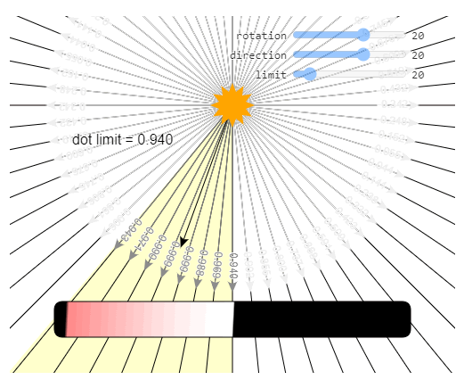

一开始光线照向所有的方向, 然后指定一个方向表示聚光灯的方向, 选择一个限定. 通过一个限定我们计算一个点乘限定, 只需要对限定值取余弦就可以得到. 如果与选定聚光灯方向的点乘大于这个点乘限定, 就照亮. 否则不照亮.

限制值转换:

| 角度 | 弧度 | 点乘空间 |
| ---- | ---- | -------- |
| 0    | 0.0  | 1.0      |
| 22   | .38  | .93      |
| 45   | .79  | .71      |
| 67   | 1.17 | .39      |
| 90   | 1.57 | 0.0      |
| 180  | 3.14 | -1.0     |

### step

GLSL函数 `step`的功能是, 获取两个值, 如果第二个值大于或等于第一个值就返回 1.0, 否则返回 0, 用 JavaScript 大概可以这样表示.

```js
function step(a, b) {
    if(b >= a) {
        return 1;
    } else {
        return 0;
    }
}
```

### smoothstep

与 `step`相似, `smoothstep(lowerBound, upperBound, value)` 获取最大和最小边界值, 并返回 `value`值在边界范围内映射到 `0 - 1` 之间的插值.

# 组织和重构

## 十七. WebGL 码少趣多

编写 WebGL 代码时，你需要将着色器对链接到程序中，然后找到输入变量的位置。这些输入变量包括属性和全局变量，找到他们的位置非常啰唆和无聊。

```js
// 初始化时
var u_lightWorldPosLoc = gl.getUniformLocation(program, 'u_lightWorldPos');
// 有多少 uniform 就需要写多少次 gl.getUniformLocation

var a_positionLoc = gl.getAttribLocation(progame, 'a_position');
// 有多少 attribue 就需要写多少次 gl.getAttribLocation

// 初始化或绘制时需要的全局变量
var lightWorldPos = [100, 200, 300];
var positionBuffer = gl.createBuffer();
var positionNumComponents = new Float32Array([0, 0, 1]);
var diffuseTextureUnit = 0;
// 以及其他变量值

// 绘制时
gl.useProgram(program);

// 设置所有的缓冲和属性 有多少缓冲属性就要执行多少次上面三步，绑定buffer，填充数据，启用
gl.bindBuffer(gl.ARRAY_BUFFER, positionBuffer);
gl.vertexAttribPointer(a_positionLoc, positionNumComponents, gl.FLOAT, false, 0, 0);
gl.enableVertexAttribArray(a_positionLoc);

// 设置使用的纹理 有多少纹理就要按 TEXTURE0, TEXTURE1 的顺序依次启用纹理并绑定
gl.activeTexture(gl.TEXTURE0 + diffuseTextureUnit);
gl.bindTexture(gl.TEXTURE_2D, diffuseTexture);

// 设置所有的全局变量 有多少全局变量就要按数据的类型(float/vec2/vec3/vec4/mat4...)设置多少次
gl.uniform3fv(u_lightWorldPosLoc, lightWorldPos)

// 最后
gl.drawArrays(...);

```

这会导致需要写很多代码。

这里有很多方式简化这个过程，首先可以一次性获取 WebGL 中需要的所有属性和全局变量的位置，然后在一个方法中设置它们。我们可以传递一个 JavaScript 对象给这个方法。

像这样：

```js
// 初始化时
var uniformSetters = webglUtils.createUniformSettes(gl, program);
var attribSetters = webglUtils.createAttributeSetters(gl, program);

var attribs = {
  a_position: { buffer: positionBuffer, numComponents: 3 },
  // 其他 attr
};

// 初始化或绘制时需要的全局变量值
var uniforms = {
  u_lightWorldPos: [100, 200, 300],
  // 其他 uniforms
  u_diffuse: diffuseTexture,
};

// 绘制时
gl.useProgram(program);

// 设置所有的缓冲和属性
webglUtils.setAttributes(attribSetters, attribs);

// 设置需要的全局变量和纹理
webglUtils.setUniforms(uniformSetters, uniforms);

gl.drawArrays(...);
```

这样看起来就简单，清晰，代码量少一些了。

如果需要你也可以使用多个 JavaScript 对象。

这是使用这个辅助方法的一个例子：

code1

继续让代码更少一点，在之前的代码中我们用自己创建的缓冲设置 `attribs`，假设你想创建一个位置，法向量和纹理坐标的缓冲，你可能需要写这些代码：

```js
// 一个三角形
var positions = [0, -10, 0, 10, 10, 0, -10, 10, 0];
var texcoords = [0.5, 0, 1, 1, 0, 1];
var normals   = [0, 0, 1, 0, 0, 1, 0, 0, 1];

var positionBuffer = gl.createBuffer();
gl.bindBuffer(gl.ARRAY_BUFFER, positionBuffer);
gl.bufferData(gl.ARRAY_BUFFER, new FLoat32Array(positions), gl.STATIC_DRAW);

// 同样需要创建 texcoordBuffer 和 normalBuffer
```

简化形式是这样：

```js
// 一个三角形
var arrays = {
   position: { numComponents: 3, data: [0, -10, 0, 10, 10, 0, -10, 10, 0], },
   texcoord: { numComponents: 2, data: [0.5, 0, 1, 1, 0, 1],               },
   normal:   { numComponents: 3, data: [0, 0, 1, 0, 0, 1, 0, 0, 1],        },
};

var bufferInfo = createBufferInfoFromArrays(gl, arrays);

// 渲染时
webglUtils.setBuffersAndAttributes(gl, attribSetters, bufferInfo);

...

// 绘制几何体
gl.drawArrays(gl.TRIANGLES, 0, bufferInfo.numElements);
```

这是结果：

code2

甚至在使用索引时也可以这样做，`webglUtils.setBuffersAndAttributes`会设置所有属性并使用你提供的 `indices`设置 `ELEMENT_ARRAY_BUFFER`，所以你需要调用 `gl.drawElements`。

```js
// 索引矩形
var arrays = {
   position: { numComponents: 3, data: [0, 0, 0, 10, 0, 0, 0, 10, 0, 10, 10, 0], },
   texcoord: { numComponents: 2, data: [0, 0, 0, 1, 1, 0, 1, 1],                 },
   normal:   { numComponents: 3, data: [0, 0, 1, 0, 0, 1, 0, 0, 1, 0, 0, 1],     },
   indices:  { numComponents: 3, data: [0, 1, 2, 1, 2, 3],                       },
};

var bufferInfo = webglUtils.createBufferInfoFromArrays(gl, arrays);

// 设置所有需要的缓冲和属性
webglUtils.setBuffersAndAttributes(gl, attribSetters, bufferInfo);

...

// 绘制几何体
gl.drawElements(gl.TRIANGLES, bufferInfo.numElements, gl.UNSIGNED_SHORT, 0);
```

这是结果：

code3

`createBufferInfoFromArrays`方法本质上创建了类似这样的一个对象：

```js
bufferInfo = {
  numElements: 4, // 或者其他元素的实际个数
  indices: WebGLBuffer, // 如果没有索引这个属性就不存在
  attribs: {
    a_position: { buffer: WebGLBuffer, numComponents: 3 },
    a_normal: { buffer: WebGLBuffer, numComponents: 3 },
    a_texcoord: { buffer: WebGLBuffer, numComponents: 2 },
  }
}
```

然后 `webglUtils.setBuffersAndAttributes`使用通过这个对象设置所有的缓冲和属性。

最后是我们假定 `position`总是有三个单位长度(x, y, z)，`texcoords`总是有 2 个单位长度，索引 3 个单位长度，法向量 3 个单位长度，然后让程序推测出单元的个数。

对应版本：

code4

并不能确定哪个方式更好，因为推测有可能出错。例如想在纹理坐标中添加一个单位长度存储其他信息，按照 2 个单位去推测单元个数就会出错。当然，如果出错了可以像前一个例子那样声明单元个数。

为什么不按照属性在着色器中的类型来确定单元的个数？因为当我们使用 `vec4`时，大多数情况下只从缓冲中提供 3 个单位长度的数据，WebGL 会自动设置 `w = 1`。所以这就意味着我们不能轻易推断出用户的真实意愿，因为他们在着色器中定义的单位长度可能和提供的长度不相符。

下面是一个针对 Setters 简单的简化：

code5

### 我们能直接使用 setter 么？


## WebGL 绘制多个物体

## WebGL 场景图

# 几何

## WebGL 三维几何加工

## WebGL 加载 .obj 文件

## WebGL 加载带 .mtl 的 .obj 文件

# 纹理

## WebGL 三维纹理

## WebGL 数据纹理

## WebGL 使用多个纹理

## WebGL 跨域图像

## WebGL 纹理映射的透视纠正

## 平面和透视的投影映射

# 渲染到纹理

## WebGL 渲染到纹理

# Shadows

## 阴影

# 技术

## 二维

### WebGL 二维 DrawImage

### WebGL 二维矩阵栈

### 精灵

## 三维

### WebGL 立方体贴图

### WebGL 环境贴图

### WebGL 天空盒

### WebGL 蒙皮

### WebGL 雾

### Picking (clicking on stuff)

## 文字

### WebGL 文件 - HTML

### WebGL 文字 - 二维 Canvas

### WebGL 文字 - 使用纹理

### WebGL 方字 - 使用字形纹理

## 纹理

### Ramp Textures (Toon Shading)

## GPGPU

### GPGPU

# Tips

## WebGL 最小的程序

## Drawing Without Data

## WebGL Shadertoy

[shadertoy1](shadertoy1/index.ts)

**可变颜色**

WebGL 提供了一个全局变量 `gl_FragCoord`, 该变量等于当前正在绘制的像素的坐标.

```diff
precision highp float;

void main() {
-    gl_FragColor = vec4(1, 0, 0.5, 1);
+    gl_FragColor = vec4(fract(gl_FragCoord.xy / 50.0), 0, 1);
}
```

`fract`用来获取数字的小数部分(类似%), 

显示的结果就是红色与绿色值, 每50像素从0变化到1.

**根据画布大小渐进**

新增一个 `u_resolution`用来接收画布的大小, 保证红色和绿色散布到整个画布大小.

```diff
precision highp float;

+ uniform vec2 u_resolution;

void main() {
-	gl_FragColor = vec4(fract(gl_FragCoord.xy / 50.0), 0, 1);
+	gl_FragColor = vec4(fract(gl_FragCoord.xy / u_resolution), 0, 1);
}

...

+	const u_resolution = webglUtils.getUniformLocation(gl, program, 'u_resolution');

...

+	u_resolution.uniform2f(canvas.width, canvas.height);
```

**传递鼠标位置**

```diff
+	uniform vec2 u_mouse;

void main() {
-	gl_FragColor = vec4(fract(gl_FragCoord.xy / u_resolution), 0, 1);
+	gl_FragColor = vec4(fract((gl_FragCoord.xy - u_mouse) / u_resolution), 0, 1);
}

...

+	const u_mouse = webglUtils.getUniformLocation(gl, program, 'u_mouse');

...

+    canvas.addEventListener('mousemove', (e) => {
+        const rect = canvas.getBoundingClientRect();
+        mouseX = e.clientX - rect.left;
+        mouseY = rect.height - (e.clientY - rect.top) - 1; // 在 WebGL 中, 底部为0
+        render();
+    });
```

如果要兼容触屏设备还需要监听 `touchmove`等事件.

**时间动画**

```diff
precision highp float;

uniform vec2 u_resolution;
uniform vec2 u_mouse;
+	uniform float u_time;

void main() {
-	gl_FragColor = vec4(fract((gl_FragCoord.xy - u_mouse) / u_resolution), 0, 1);
+	gl_FragColor = vec4(fract((gl_FragCoord.xy - u_mouse) / u_resolution), fract(u_time), 1);
}

...

+	  const u_time = webglUtils.getUniformLocation(gl, program, 'u_time');

...

+	time *= 0.001; // 毫秒转换为秒

...

+	u_time.uniform1f(time);

...

+	requestAnimationFrame(render);
```

### shadertoy.com demo

[shadertoy2](shadertoy2/index.ts)

## Pulling Vertices

# Optimization

## 顶点索引 (gl.drawElements)

## 实例化绘制

# 杂项

## WebGL 设置和安装

## WebGL 样板

WebGL 复杂的原因之一是需要两个方法, 一个顶点着色器和一个片断着色器. 这两个方法通常是在 GPU 上运行的, 这也是高速运行的保障. 所以它们是一种自定义语言, 目的是能够在 GPU 上良好的运行. 并且这两个方法需要编译并链接在一起, 而这个过程在 99% 的 WebGL 应用中是一样的.

所以可以将编译着色器, 链接2个着色器到一个着色器程序中等的代码作为一个工具类提供, 减少项目中样板代码.

[代码](./webgl-utils.ts)

## WebGL 重置画布尺寸

每个画布都有两个尺寸, 一个是 drawingbuffer 的尺寸, 这个表示画布中有多少个像素. 另一个是画布显示的尺寸, 由 CSS 决定画布显示的尺寸.

可以通过两种方式设置画布的 drawingbuffer 尺寸.

一种是使用 HTML:

```html
<canvas id="c" width="400" height="300"></canvas>
```

另一种是使用 JavaScript:

```js
const canvas = document.querySelector('#c');
canvas.width = 400;
canvas.height = 300;
```

如果没有使用 CSS 影响画布的显示尺寸, 则画布的显示尺寸和 drawingbuffer 尺寸相同. 所以上述两个例子中画布的 drawingbuffer 尺寸和显示尺寸都是 400x300.

下方的例子则会让画布的显示尺寸是 400x300, drawingbuffer 是 10x15.

```html
<canvas id="#c" width="10" height="15" style="width: 400px; height: 300px;"></canvas>
```

此时画布中的图像是模糊的, 因为浏览器得到了一个 10x15 像素的画布, 并将它拉伸到 400x300 像素, 并且在拉伸过程中进行了插值.

如果要让画布的 drawingbuffer 的尺寸和画布显示尺寸一致, 可以使用 `clientWidth`和 `clientHeight`属性, 这两个属性是所有 HTML 元素都有的属性, 可以让 JavaScript 获取元素显示的尺寸.

```typescript
export function resize(canvas: HTMLCanvasElement): void {
  // 获取浏览器中画布的显示尺寸
  const displayWidth = canvas.clientWidth;
  const displayHeight = canvas.clientHeight;

  // 检测尺寸是否相同
  if (canvas.width != displayWidth || canvas.height != displayHeight) {
    // 设置为相同尺寸
    canvas.width = displayWidth;
    canvas.height = displayHeight;
  }
}
```

修改后会发现显示的内容并没有覆盖整个区域, 原因是重置画布尺寸的时候还需要调用 `gl.viewport`设置视域, `gl.viewport`告诉 WebGL 如何将裁剪空间(-1 到 +1)中的点转换到像素空间, 也就是画布内的 drawingbuffer. 当第一次创建 WebGL 上下文的时候 WebGL 会设置视域大小和画布大小匹配, 但是在那之后如果改变了画布大小就需要你自己去设置 WebGL 新的视域大小.

```typescript
function drawScene() {
    resize(gl.canvas);
    gl.viewport(0, 0, gl.canvas.width, gl.canvas.height);
}
```

可能会有疑问, 为什么 WebGL 不在画布尺寸改变的时候自动修改视域? 原因是它并不知道你如何以及为什么使用视域, 你可以渲染到一个帧缓冲或者做其他的事情需要不同的视域尺寸.

#### HD-DPI 该怎么办?

当使用 CSS 像素值声明画布的尺寸时, 这个叫做 CSS 像素值, 但它可能并不是真实像素值. 大多数现代智能手机有叫做高清显示(HD-DPI)或苹果叫它"Retina Display"的特性. 对于文本和大多数 CSS 样式浏览器会自动绘制 HD-DPI 图形, 但是对于 WebGL, 由于是由你来控制绘制图形的, 所以需要你自己来决定是绘制一般分辨率还是 "HD-DPI" 品质.

可以通过 `window.devicePixelRatio`的值获得1个 CSS 像素对应多少个实际像素.

```typescript
export function resize(canvas: HTMLCanvasElement): void {
  // 1个CSS像素对应多少个实际像素
  const realToCSSPixels = window.devicePixelRatio;

  // 获取浏览器中画布的显示尺寸
  const displayWidth = Math.floor(canvas.clientWidth * realToCSSPixels);
  const displayHeight = Math.floor(canvas.clientHeight * realToCSSPixels);

  // 检测尺寸是否相同
  if (canvas.width != displayWidth || canvas.height != displayHeight) {
    // 设置为相同尺寸
    canvas.width = displayWidth;
    canvas.height = displayHeight;
  }
}
```

是否需要根据 HD-DPI 做调整取决于你自己, 如果想要绘制用于打印的图形, 可能会希望支持 HD-DPI, 如果是游戏, 可能会想给用户多种选择, 让他们根据自己的机器调整配置, 控制显示分辨率.